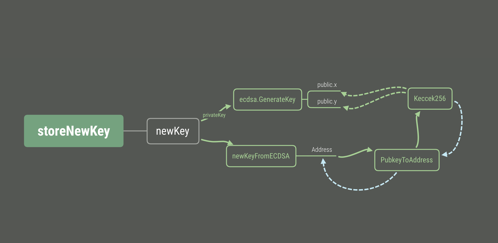

# Accounts EOA Analysis

이더리움 EOA 계정 생성 과정을 분석해보자.


필자가 분석한 코드를 다이어그램으로 간략화하면 다음과 같다.




### storeNewKey

첫 시작부분을 storeNewKey이다.

[accounts/keystore/key.go#L169-L183](https://github.com/ethereum/go-ethereum/blob/master/accounts/keystore/key.go#L169-L183)

```go
func storeNewKey(ks keyStore, rand io.Reader, auth string) (*Key, accounts.Account, error) {
	key, err := newKey(rand)
	if err != nil {
		return nil, accounts.Account{}, err
	}
	a := accounts.Account{
		Address: key.Address,
		URL:     accounts.URL{Scheme: KeyStoreScheme, Path: ks.JoinPath(keyFileName(key.Address))},
	}
	if err := ks.StoreKey(a.URL.Path, key, auth); err != nil {
		zeroKey(key.PrivateKey)
		return nil, a, err
	}
	return key, a, err
}
```

### newKey

newKey에서 ecdsa.GenerateKey()를 호출한다.
ecdsa는 타원곡선 dsa 알고리즘이다.
crypto/ecdsa 패키지는 go-ethereum이 아닌 go 언어에 자체 내장되어 있다.

[accounts/keystore/key.go#L161-L167](
https://github.com/ethereum/go-ethereum/blob/master/accounts/keystore/key.go#L161-L167)

```go
func newKey(rand io.Reader) (*Key, error) {
	privateKeyECDSA, err := ecdsa.GenerateKey(crypto.S256(), rand)
	if err != nil {
		return nil, err
	}
	return newKeyFromECDSA(privateKeyECDSA), nil
}
```

### ecdsa.GenereteKey

그래서 golang docs에서 crypto/ecdsa에 generateKey() 함수를 찾을 수 있었다. privatekey로부터 publickey와 x,y 좌표가 생성되는 것을 확인했다.

[crypto/ecdsa/ecdsa.go#L105](https://golang.org/src/crypto/ecdsa/ecdsa.go#L105)
```go
// GenerateKey generates a public and private key pair.
func GenerateKey(c elliptic.Curve, rand io.Reader) (*PrivateKey, error) {
	k, err := randFieldElement(c, rand)
	if err != nil {
		return nil, err
	}

	priv := new(PrivateKey)
	priv.PublicKey.Curve = c
	priv.D = k
	priv.PublicKey.X, priv.PublicKey.Y = c.ScalarBaseMult(k.Bytes())
	return priv, nil
}

```

newKey에서 newKeyFromECDSA(privateKeyECDSA)를 반환한다. ```crypto.PubkeyToAddress(privateKeyECDSA.PublicKey)``` 에서 publickey로부터 ethereum address를 생성하는 함수이다.


### newKeyFromECDSA

[accounts/keystore/key.go#L130-L138](https://github.com/ethereum/go-ethereum/blob/master/accounts/keystore/key.go#L130-L138)
```go
func newKeyFromECDSA(privateKeyECDSA *ecdsa.PrivateKey) *Key {
	id := uuid.NewRandom()
	key := &Key{
		Id:         id,
		Address:    crypto.PubkeyToAddress(privateKeyECDSA.PublicKey),
		PrivateKey: privateKeyECDSA,
	}
	return key
}
```


### PubkeyToAddress


PubkeyToAddress() 함수를 보면 publickey를 keccak256 해쉬화를 하고 12이후로 슬라이스해 20 bytes만 ethereum address로 사용한다.

[crypto/crypto.go#L197-L200](https://github.com/ethereum/go-ethereum/blob/461291882edce0ac4a28f64c4e8725b7f57cbeae/crypto/crypto.go#L197-L200)

```go
func PubkeyToAddress(p ecdsa.PublicKey) common.Address {
	pubBytes := FromECDSAPub(&p)
	return common.BytesToAddress(Keccak256(pubBytes[1:])[12:])
}
```

FromECDSAPub()는 
pub.X, pub.Y 좌표를 합쳐주는 함수이다.

[crypto/crypto.go#L136-L141](
https://github.com/ethereum/go-ethereum/blob/461291882edce0ac4a28f64c4e8725b7f57cbeae/crypto/crypto.go#L136-L141)

```go
func FromECDSAPub(pub *ecdsa.PublicKey) []byte {
	if pub == nil || pub.X == nil || pub.Y == nil {
		return nil
	}
	return elliptic.Marshal(S256(), pub.X, pub.Y)
}

```


NewKeccak256()에서 32 bytes 길이의 hash로 리턴한다.

[crypto/sha3/hashes.go#L15-L16](https://github.com/ethereum/go-ethereum/blob/461291882edce0ac4a28f64c4e8725b7f57cbeae/crypto/sha3/hashes.go#L15-L16)

```go
// NewKeccak256 creates a new Keccak-256 hash.
func NewKeccak256() hash.Hash { return &state{rate: 136, outputLen: 32, dsbyte: 0x01} }
```

[common/types.go#L162-L168](
https://github.com/ethereum/go-ethereum/blob/3e8184006189b57e2d998313ef0fa75429b0c5bc/common/types.go#L162-L168)

```go
// BytesToAddress returns Address with value b.
// If b is larger than len(h), b will be cropped from the left.
func BytesToAddress(b []byte) Address {
	var a Address
	a.SetBytes(b)
	return a
}
```

