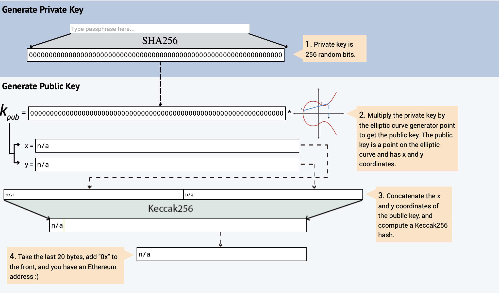
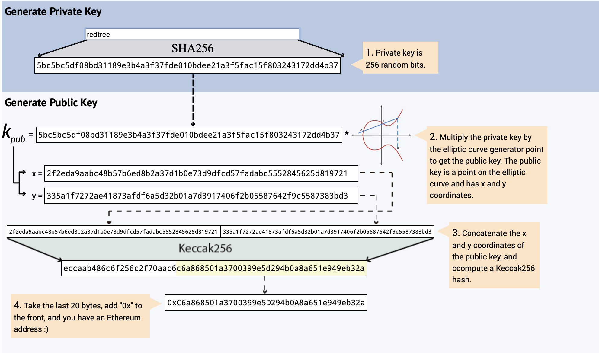
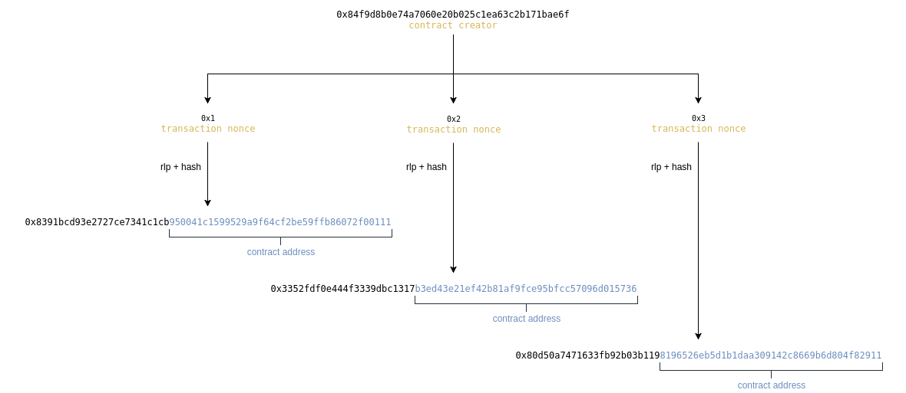

# Accounts

[Reference]

[How does Ethereum work, anyway?](https://medium.com/@preethikasireddy/how-does-ethereum-work-anyway-22d1df506369)

[스마트 컨트랙트를 이용한 사용자 중심 신원 관리 시스템](http://mmlab.snu.ac.kr/publications/docs/KICS_2018winter_mhkang.pdf)

[ethereum_evm_illustrated](
https://takenobu-hs.github.io/downloads/ethereum_evm_illustrated.pdf)


이더리움 계정은 크게 두가지로 분류된다.

이더리움에는 비밀키에 의해 통제되는 외부 소유 계정(Externally Owned Account - EOA)과 코드에 의해 통제되는 컨트랙트 계정(Contract Account)이다.

EOA는 컨트렉트 계정과 달리 code가 할당되지는 않는다.

컨트렉트 계정은 contract code(컨트렉트가 컴파일 된 bytecode)에 의해 제어된다. 

 


## 외부 소유 계정(EOA - Externally Owned Accounts) vs. 컨트렉트 계정(contract accounts)

EOA는 다른 EOA로 트랜젝션을 요청 및 배포하거나 컨트렉트 계정을 생성하고 그 컨트렉트로부터 다른 컨트렉트 계정으로 트랜젝션을 요청할 수 있다.

컨트렉트 게정은 스스로 트랜젝션을 초기화 및 배포 할 수는 없다. 그 대신,
컨트렉트 게정는 EOA나 다른 컨트렉트 게정의 트랜젝션 응답으로 처리된다.


결론적으로, 블록체인에서 발생하는 모든 데이터 처리는 EOA로부터 발생하는 트랜젝션 동작의 집합이다.


그렇다면 이 두 계정은 어떻게 생성이 될까?

외부 소유 계정(EOA)와 컨트렉트 계정(CA)의 생성 과정을 알아보자.


### EOA (Externally Owned Accounts)

[Reference]

[eth-graphical-address](https://www.royalfork.org/2017/12/10/eth-graphical-address/)

[keccak-specs-summary](https://keccak.team/keccak_specs_summary.html)

먼저 EOA부터 알아보자.

[eth-graphical-address](https://www.royalfork.org/2017/12/10/eth-graphical-address/) 에서 ethereum 키 생성 과정을 해볼 수 있다.

"Type passpharse here.."에 임의의 값을 넣으면, 아래 과정을 수행한다.



1. passpharse에 따라 sha256으로 privatekey 생성
2. secp256k1(타원곡선알고리즘)에 의해 publickey를 구한다. 이때 publickey는 타원곡선 상에 존재하기 때문에 그 지점의 x, y값을 구할 수 있다.
3. x , y 좌표의 결합한 값을 keccak256으로 해쉬화한다.
4. keccak256으로 해쉬된 값의 끝에서 20byte (160bit) 자른 값이 EOA이다.
 
이더리움 계정이 생성된다.



| 종류 | 암호알고리즘 | bit|
|---|---|---|
| private key| sha256 | 512 |
| public key| secp256k1 | 512 |
| address | keccak256 | 160 |

### CA (Contract Accounts)

[Reference]

[ethereum-transaction](https://medium.com/@codetractio/inside-an-ethereum-transaction-fa94ffca912f)


컨트렉트 계정의 주소는 EOA의 주소값과 Nonce을 RIP, KEC 등으로 암호화한 값이며 160 bit이다. 
여기서 nonce값은 transaction에 있는 Nonce값이다. (nonce가 여기저기에 있어 개인적으로 이해하기 힘들었음..)

CA의 생성 시점이 EOA가 컨트렉트를 블록체인에 배포(트랜젝션)할 때 생성이 되기 때문이다.




## Account state

account state는 nonce, balance, storageRoot, codeHash로 구성 된다.


nonce: 

EOA의 경우 -  EOA가 보낸 트랜젝션의 수

컨트렉트 계정의 경우 - EOA에 의해 만들어진 컨트렉트 수

balance : 공통, 계정이 소유한 Wei. ```1e+18 Wei 당 1 Ether```

storageRoot :

EOA의 경우 - empty

컨트렉트 계정의 경우  - storage(Merkle Patricia trie)의 hash 값


codeHash :

EOA의 경우 - empty

컨트렉트 계정의 경우 - 컨트렉트 코드의 hash 값


