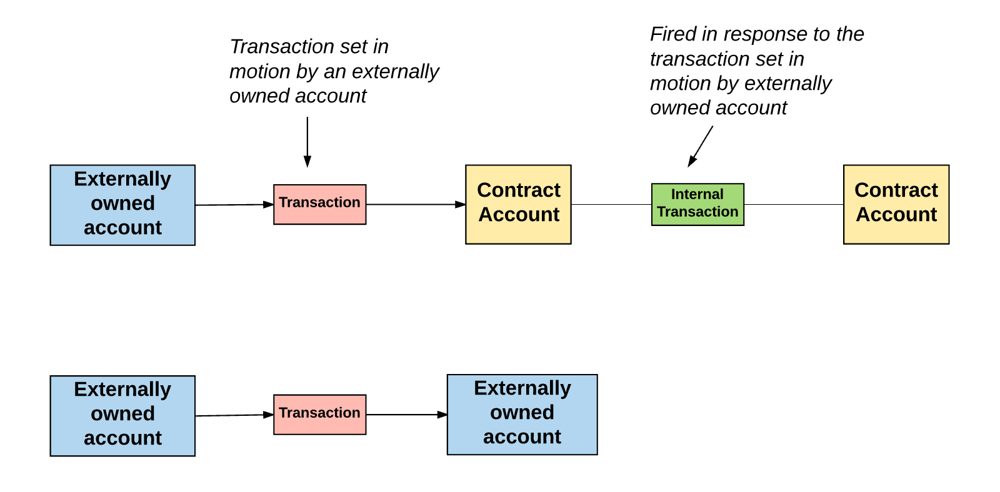
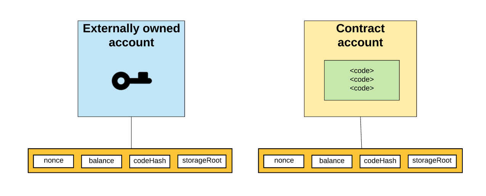

# Accounts

[Reference]

[How does Ethereum work, anyway?](https://medium.com/@preethikasireddy/how-does-ethereum-work-anyway-22d1df506369)

[스마트 컨트랙트를 이용한 사용자 중심 신원 관리 시스템](http://mmlab.snu.ac.kr/publications/docs/KICS_2018winter_mhkang.pdf)

[ethereum_evm_illustrated](
https://takenobu-hs.github.io/downloads/ethereum_evm_illustrated.pdf)


이더리움 계정은 크게 두가지로 분류된다.

이더리움에는 비밀키에 의해 통제되는 외부 소유 계정(Externally Owned Account - EOA)과 코드에 의해 통제되는 컨트랙트 계정(Contract Account)이다.

EOA는 컨트렉트 계정과 달리 code가 할당되지는 않는다.

컨트렉트 계정은 contract code(컨트렉트가 컴파일 된 bytecode)에 의해 제어된다. 

 


account의 주소는 

EOA의 주소는 private key와 public key의 해쉬로 길이는 160 bit이다. 

컨트렉트 계정의 주소는 EOA의 주소값과 Nonce을 RIP, KEC 등으로 암호화한 값이며 160 bit이다. 


## 외부 소유 계정(EOA - Externally Owned Accounts) vs. 컨트렉트 계정(contract accounts)

EOA는 다른 EOA로 트랜젝션을 요청 및 배포하거나 컨트렉트 계정을 생성하고 그 컨트렉트로부터 다른 컨트렉트 계정으로 트랜젝션을 요청할 수 있다.

컨트렉트 게정은 스스로 트랜젝션을 초기화 및 배포 할 수는 없다. 그 대신,
컨트렉트 게정는 EOA나 다른 컨트렉트 게정의 트랜젝션 응답으로 처리된다.



결론적으로, 블록체인에서 발생하는 모든 데이터 처리는 EOA로부터 발생하는 트랜젝션 동작의 집합이다.


## Account state

account state는 nonce, balance, storageRoot, codeHash로 구성 된다.



nonce: 

EOA의 경우 -  EOA가 보낸 트랜젝션의 수

컨트렉트 계정의 경우 - EOA에 의해 만들어진 컨트렉트 수

balance : 공통, 계정이 소유한 Wei. ```1e+18 Wei 당 1 Ether```

storageRoot :

EOA의 경우 - empty

컨트렉트 계정의 경우  - storage(Merkle Patricia trie)의 hash 값


codeHash :

EOA의 경우 - empty

컨트렉트 계정의 경우 - 컨트렉트 코드의 hash 값


