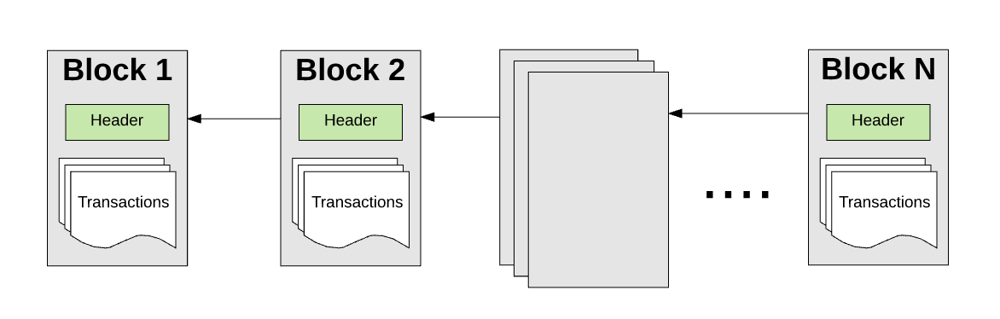
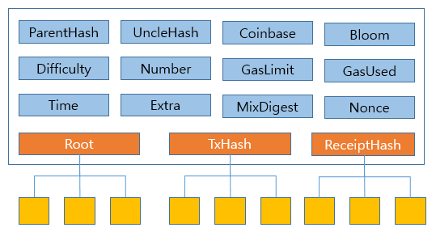

# Blocks

[Reference]

[이더리움 코어의 데이터 계층 - 블록과 가스](http://ihpark92.tistory.com/45?category=747040)

[ethereum-block-architecture](https://ethereum.stackexchange.com/questions/268/ethereum-block-architecture)

[user-content-ethereum-blockchain
](https://github.com/ethereum/wiki/wiki/Glossary#user-content-ethereum-blockchain)


블록이 무엇이며 블록의 구성요소에 대해 분석해본다.

Blockchain, Block, Header, GenesisBlock 순으로 분석해보자.


소스 코드 상, Blockchain, Block, Blockheader 간 관계는 다음과 같다.


## Blockchain

블록체인은 말 그대로 여러 블록을 연결한 것이다.

blockchain structure에 맴버로 genesisBlock와 currentBlock이 정의 되어 있다.

[core/blockchain.go](https://github.com/ethereum/go-ethereum/blob/f32790fb0508bb484a100d6e5c81bec2c89bebb1/core/blockchain.go#L89)


```go
// The BlockChain also helps in returning blocks from **any** chain included
// in the database as well as blocks that represents the canonical chain. It's
// important to note that GetBlock can return any block and does not need to be
// included in the canonical one where as GetBlockByNumber always represents the
// canonical chain.
type BlockChain struct {
	chainConfig *params.ChainConfig // Chain & network configuration
	cacheConfig *CacheConfig        // Cache configuration for pruning

	db     ethdb.Database // Low level persistent database to store final content in
	triegc *prque.Prque   // Priority queue mapping block numbers to tries to gc
	gcproc time.Duration  // Accumulates canonical block processing for trie dumping

	hc            *HeaderChain
	rmLogsFeed    event.Feed
	chainFeed     event.Feed
	chainSideFeed event.Feed
	chainHeadFeed event.Feed
	logsFeed      event.Feed
	scope         event.SubscriptionScope
	genesisBlock  *types.Block

	mu      sync.RWMutex // global mutex for locking chain operations
	chainmu sync.RWMutex // blockchain insertion lock
	procmu  sync.RWMutex // block processor lock

	checkpoint       int          // checkpoint counts towards the new checkpoint
	currentBlock     atomic.Value // Current head of the block chain
	currentFastBlock atomic.Value // Current head of the fast-sync chain (may be above the block chain!)

	stateCache    state.Database // State database to reuse between imports (contains state cache)
	bodyCache     *lru.Cache     // Cache for the most recent block bodies
	bodyRLPCache  *lru.Cache     // Cache for the most recent block bodies in RLP encoded format
	receiptsCache *lru.Cache     // Cache for the most recent receipts per block
	blockCache    *lru.Cache     // Cache for the most recent entire blocks
	futureBlocks  *lru.Cache     // future blocks are blocks added for later processing

	quit    chan struct{} // blockchain quit channel
	running int32         // running must be called atomically
	// procInterrupt must be atomically called
	procInterrupt int32          // interrupt signaler for block processing
	wg            sync.WaitGroup // chain processing wait group for shutting down

	engine    consensus.Engine
	processor Processor // block processor interface
	validator Validator // block and state validator interface
	vmConfig  vm.Config

	badBlocks      *lru.Cache              // Bad block cache
	shouldPreserve func(*types.Block) bool // Function used to determine whether should preserve the given block.
}
```

Config 파라미터에 따라 blockchain 인스턴스 리턴

[core/blockchain.go](https://github.com/ethereum/go-ethereum/blob/f32790fb0508bb484a100d6e5c81bec2c89bebb1/core/blockchain.go#L141)

```
// NewBlockChain returns a fully initialised block chain using information
// available in the database. It initialises the default Ethereum Validator and
// Processor.
func NewBlockChain(db ethdb.Database, cacheConfig *CacheConfig, chainConfig *params.ChainConfig, engine consensus.Engine, vmConfig vm.Config, shouldPreserve func(block *types.Block) bool) (*BlockChain, error) {
	if cacheConfig == nil {
		cacheConfig = &CacheConfig{
			TrieCleanLimit: 256,
			TrieDirtyLimit: 256,
			TrieTimeLimit:  5 * time.Minute,
		}
	}
	bodyCache, _ := lru.New(bodyCacheLimit)
	bodyRLPCache, _ := lru.New(bodyCacheLimit)
	receiptsCache, _ := lru.New(receiptsCacheLimit)
	blockCache, _ := lru.New(blockCacheLimit)
	futureBlocks, _ := lru.New(maxFutureBlocks)
	badBlocks, _ := lru.New(badBlockLimit)

	bc := &BlockChain{
		chainConfig:    chainConfig,
		cacheConfig:    cacheConfig,
		db:             db,
		triegc:         prque.New(nil),
		stateCache:     state.NewDatabaseWithCache(db, cacheConfig.TrieCleanLimit),
		quit:           make(chan struct{}),
		shouldPreserve: shouldPreserve,
		bodyCache:      bodyCache,
		bodyRLPCache:   bodyRLPCache,
		receiptsCache:  receiptsCache,
		blockCache:     blockCache,
		futureBlocks:   futureBlocks,
		engine:         engine,
		vmConfig:       vmConfig,
		badBlocks:      badBlocks,
	}
	bc.SetValidator(NewBlockValidator(chainConfig, bc, engine))
	bc.SetProcessor(NewStateProcessor(chainConfig, bc, engine))

	var err error
	bc.hc, err = NewHeaderChain(db, chainConfig, engine, bc.getProcInterrupt)
	if err != nil {
		return nil, err
	}
	bc.genesisBlock = bc.GetBlockByNumber(0)
	if bc.genesisBlock == nil {
		return nil, ErrNoGenesis
	}
	if err := bc.loadLastState(); err != nil {
		return nil, err
	}
	// Check the current state of the block hashes and make sure that we do not have any of the bad blocks in our chain
	for hash := range BadHashes {
		if header := bc.GetHeaderByHash(hash); header != nil {
			// get the canonical block corresponding to the offending header's number
			headerByNumber := bc.GetHeaderByNumber(header.Number.Uint64())
			// make sure the headerByNumber (if present) is in our current canonical chain
			if headerByNumber != nil && headerByNumber.Hash() == header.Hash() {
				log.Error("Found bad hash, rewinding chain", "number", header.Number, "hash", header.ParentHash)
				bc.SetHead(header.Number.Uint64() - 1)
				log.Error("Chain rewind was successful, resuming normal operation")
			}
		}
	}
	// Take ownership of this particular state
	go bc.update()
	return bc, nil
}
```

<!--goroutine으로 update()비동기 수행

[core/blockchain.go](https://github.com/ethereum/go-ethereum/blob/f32790fb0508bb484a100d6e5c81bec2c89bebb1/core/blockchain.go#L1525)

```go
func (bc *BlockChain) update() {
	futureTimer := time.NewTicker(5 * time.Second)
	defer futureTimer.Stop()
	for {
		select {
		case <-futureTimer.C:
			bc.procFutureBlocks()
		case <-bc.quit:
			return
		}
	}
}
```

-->
ethereum object 가 초기화될 때 NewBlockChain를 호출한다.

[eth/backend.go](https://github.com/ethereum/go-ethereum/blob/f32790fb0508bb484a100d6e5c81bec2c89bebb1/eth/backend.go#L102)

```go

// New creates a new Ethereum object (including the
// initialisation of the common Ethereum object)
func New(ctx *node.ServiceContext, config *Config) (*Ethereum, error) {
	// Ensure configuration values are compatible and sane
	if config.SyncMode == downloader.LightSync {
		return nil, errors.New("can't run eth.Ethereum in light sync mode, use les.LightEthereum")
	}
	if !config.SyncMode.IsValid() {
		return nil, fmt.Errorf("invalid sync mode %d", config.SyncMode)
	}
	if config.MinerGasPrice == nil || config.MinerGasPrice.Cmp(common.Big0) <= 0 {
		log.Warn("Sanitizing invalid miner gas price", "provided", config.MinerGasPrice, "updated", DefaultConfig.MinerGasPrice)
		config.MinerGasPrice = new(big.Int).Set(DefaultConfig.MinerGasPrice)
	}
	// Assemble the Ethereum object
	chainDb, err := CreateDB(ctx, config, "chaindata")
	if err != nil {
		return nil, err
	}
	chainConfig, genesisHash, genesisErr := core.SetupGenesisBlock(chainDb, config.Genesis)
	if _, ok := genesisErr.(*params.ConfigCompatError); genesisErr != nil && !ok {
		return nil, genesisErr
	}
	log.Info("Initialised chain configuration", "config", chainConfig)

	eth := &Ethereum{
		config:         config,
		chainDb:        chainDb,
		chainConfig:    chainConfig,
		eventMux:       ctx.EventMux,
		accountManager: ctx.AccountManager,
		engine:         CreateConsensusEngine(ctx, chainConfig, &config.Ethash, config.MinerNotify, config.MinerNoverify, chainDb),
		shutdownChan:   make(chan bool),
		networkID:      config.NetworkId,
		gasPrice:       config.MinerGasPrice,
		etherbase:      config.Etherbase,
		bloomRequests:  make(chan chan *bloombits.Retrieval),
		bloomIndexer:   NewBloomIndexer(chainDb, params.BloomBitsBlocks, params.BloomConfirms),
	}

	log.Info("Initialising Ethereum protocol", "versions", ProtocolVersions, "network", config.NetworkId)

	if !config.SkipBcVersionCheck {
		bcVersion := rawdb.ReadDatabaseVersion(chainDb)
		if bcVersion != core.BlockChainVersion && bcVersion != 0 {
			return nil, fmt.Errorf("Blockchain DB version mismatch (%d / %d).\n", bcVersion, core.BlockChainVersion)
		}
		rawdb.WriteDatabaseVersion(chainDb, core.BlockChainVersion)
	}
	var (
		vmConfig = vm.Config{
			EnablePreimageRecording: config.EnablePreimageRecording,
			EWASMInterpreter:        config.EWASMInterpreter,
			EVMInterpreter:          config.EVMInterpreter,
		}
		cacheConfig = &core.CacheConfig{Disabled: config.NoPruning, TrieCleanLimit: config.TrieCleanCache, TrieDirtyLimit: config.TrieDirtyCache, TrieTimeLimit: config.TrieTimeout}
	)
	eth.blockchain, err = core.NewBlockChain(chainDb, cacheConfig, eth.chainConfig, eth.engine, vmConfig, eth.shouldPreserve)
	if err != nil {
		return nil, err
	}
	// Rewind the chain in case of an incompatible config upgrade.
	if compat, ok := genesisErr.(*params.ConfigCompatError); ok {
		log.Warn("Rewinding chain to upgrade configuration", "err", compat)
		eth.blockchain.SetHead(compat.RewindTo)
		rawdb.WriteChainConfig(chainDb, genesisHash, chainConfig)
	}
	eth.bloomIndexer.Start(eth.blockchain)

	if config.TxPool.Journal != "" {
		config.TxPool.Journal = ctx.ResolvePath(config.TxPool.Journal)
	}
	eth.txPool = core.NewTxPool(config.TxPool, eth.chainConfig, eth.blockchain)

	if eth.protocolManager, err = NewProtocolManager(eth.chainConfig, config.SyncMode, config.NetworkId, eth.eventMux, eth.txPool, eth.engine, eth.blockchain, chainDb); err != nil {
		return nil, err
	}

	eth.miner = miner.New(eth, eth.chainConfig, eth.EventMux(), eth.engine, config.MinerRecommit, config.MinerGasFloor, config.MinerGasCeil, eth.isLocalBlock)
	eth.miner.SetExtra(makeExtraData(config.MinerExtraData))

	eth.APIBackend = &EthAPIBackend{eth, nil}
	gpoParams := config.GPO
	if gpoParams.Default == nil {
		gpoParams.Default = config.MinerGasPrice
	}
	eth.APIBackend.gpo = gasprice.NewOracle(eth.APIBackend, gpoParams)

	return eth, nil
}
```


## Block

[How does Ethereum work, anyway?](https://medium.com/@preethikasireddy/how-does-ethereum-work-anyway-22d1df506369)


먼저 블록이란, 여러 트렌잭션과 이전 블록(부모 블록)의 해쉬 값을 포함하는 데이터 패키지이다.




이더리움의 블록을 분석해보자.

이더리움 블록은 블록헤더, 엉클블록, 트렉젝션으로 구성 되어있다.

[core/types/blocks.go](https://github.com/ethereum/go-ethereum/blob/f32790fb0508bb484a100d6e5c81bec2c89bebb1/core/types/block.go#L126)
블록

```go
// Block represents an entire block in the Ethereum blockchain.
type Block struct {
	header       *Header
	uncles       []*Header
	transactions Transactions

	// caches
	hash atomic.Value
	size atomic.Value

	// Td is used by package core to store the total difficulty
	// of the chain up to and including the block.
	td *big.Int

	// These fields are used by package eth to track
	// inter-peer block relay.
	ReceivedAt   time.Time
	ReceivedFrom interface{}
}
```

## BlockHeader

이더리움 블록헤더 구조이다.

[core/types/blocks.go](https://github.com/ethereum/go-ethereum/blob/f32790fb0508bb484a100d6e5c81bec2c89bebb1/core/types/block.go#L70)
블록헤더

```go
// Header represents a block header in the Ethereum blockchain.
type Header struct {
	ParentHash  common.Hash    `json:"parentHash"       gencodec:"required"`
	UncleHash   common.Hash    `json:"sha3Uncles"       gencodec:"required"`
	Coinbase    common.Address `json:"miner"            gencodec:"required"`
	Root        common.Hash    `json:"stateRoot"        gencodec:"required"`
	TxHash      common.Hash    `json:"transactionsRoot" gencodec:"required"`
	ReceiptHash common.Hash    `json:"receiptsRoot"     gencodec:"required"`
	Bloom       Bloom          `json:"logsBloom"        gencodec:"required"`
	Difficulty  *big.Int       `json:"difficulty"       gencodec:"required"`
	Number      *big.Int       `json:"number"           gencodec:"required"`
	GasLimit    uint64         `json:"gasLimit"         gencodec:"required"`
	GasUsed     uint64         `json:"gasUsed"          gencodec:"required"`
	Time        *big.Int       `json:"timestamp"        gencodec:"required"`
	Extra       []byte         `json:"extraData"        gencodec:"required"`
	MixDigest   common.Hash    `json:"mixHash"`
	Nonce       BlockNonce     `json:"nonce"`
}

```

```
ParentHash : 부모 블록의 해쉬값
UncleHash : 현재 블록의 엉클블록들의 해쉬값
Coinbase : 마이닝후 해당 트랜잭션의 수수료를 받을 어카운트 주소
Root : 어카운트의 상태정보가 모여있는 머클 패트리시아 트리의 루트 노드 해쉬값
TxHash : 블록의 모든 트랜잭션에 대한 머클트리의 루트노드 해쉬값
ReceiptHash : 블록내 모든 트랜잭션에 대한 리시트들의 머클트리의 루트노드 해쉬값
Bloom : 로그 정보를 사용하는데 사용하는 32바이트 블룸필터
Difficulty : 블록 난이도로 이전블록의 난이도와 타임스탬프로 계산
Number : 현재 블록번호
GasLimit : 블록당 지급가능한 최대 가스 총합
GasUsed : 블록내 트랜잭션에 사용된 가스의 총합
Time : 블록의 최초 생성시간
Extra : 블록의 기타정보
MixDigest, Nonce : 작업증명에서 해쉬값을 계산하는데 충분한 계산횟수를 보장하기 위해 사용하는 값
```


블록헤더을 시각화 하면 다음과 같다.



블록 


## Genesis Block

[Reference]

[How does Ethereum work, anyway?](https://medium.com/@preethikasireddy/how-does-ethereum-work-anyway-22d1df506369)


Genesis Block은 첫 번째 블록이다. 앞으로 생길 블록의 설정 값을 가지고 있는 블록이다.

블록헤더에 Number는 "0"번이며 Genesis Block 이후의 블록들은 number가 1씩 증가한다.


[core/genesis.go](https://github.com/ethereum/go-ethereum/blob/f32790fb0508bb484a100d6e5c81bec2c89bebb1/core/genesis.go#L45)

```go
// Genesis specifies the header fields, state of a genesis block. It also defines hard
// fork switch-over blocks through the chain configuration.
type Genesis struct {
	Config     *params.ChainConfig `json:"config"`
	Nonce      uint64              `json:"nonce"`
	Timestamp  uint64              `json:"timestamp"`
	ExtraData  []byte              `json:"extraData"`
	GasLimit   uint64              `json:"gasLimit"   gencodec:"required"`
	Difficulty *big.Int            `json:"difficulty" gencodec:"required"`
	Mixhash    common.Hash         `json:"mixHash"`
	Coinbase   common.Address      `json:"coinbase"`
	Alloc      GenesisAlloc        `json:"alloc"      gencodec:"required"`
	// These fields are used for consensus tests. Please don't use them
	// in actual genesis blocks.
	Number     uint64      `json:"number"`
	GasUsed    uint64      `json:"gasUsed"`
	ParentHash common.Hash `json:"parentHash"`
}
```

```
Alloc : 일정량의 이더를 초기에 어카운트에 할당할때 사용하는 값으로 마이닝작업이 없이 초기에 일정량의 이더를 발생하여 ICO를 통해 판매하는데 사용할수 있습니다.
Coinbase : 마이닝후 보상코인을 수령할 주소인데 제네시스 블록에서는 마이닝이 수행되지 않기 떄문에 어떠한 값을 할당해도 무방합니다.
Nonce : mixhash와 함께 마이닝시에 사용되는 값, 8바이트
Mixhash : Nonce와 함께 마이닝시에 사용되는 값, 32바이트
Difficulty : nonce 값을 찾기위한 마이닝시의 목표값
ExtraData : 32바이트 옵션항목
GasLimit : 블록의 최대 가스량
ParentHash : 이전 부모블록의 해쉬값, 제네시스블록은 부모가 없기떄문에 0으로 할당
TimeStamp : 블록의 생성시간
```

예를 들어 
```
geth --datadir ./test init ./Genesis.json
```
수행했을 때, ```initGenesis()```가 호출 된다.

[cmd/geth/chaincmd.go](https://github.com/ethereum/go-ethereum/blob/f32790fb0508bb484a100d6e5c81bec2c89bebb1/cmd/geth/chaincmd.go#L173)

```go
// initGenesis will initialise the given JSON format genesis file and writes it as
// the zero'd block (i.e. genesis) or will fail hard if it can't succeed.
func initGenesis(ctx *cli.Context) error {
	// Make sure we have a valid genesis JSON
	genesisPath := ctx.Args().First()
	if len(genesisPath) == 0 {
		utils.Fatalf("Must supply path to genesis JSON file")
	}
	file, err := os.Open(genesisPath)
	if err != nil {
		utils.Fatalf("Failed to read genesis file: %v", err)
	}
	defer file.Close()

	genesis := new(core.Genesis)
	if err := json.NewDecoder(file).Decode(genesis); err != nil {
		utils.Fatalf("invalid genesis file: %v", err)
	}
	// Open an initialise both full and light databases
	stack := makeFullNode(ctx)
	for _, name := range []string{"chaindata", "lightchaindata"} {
		chaindb, err := stack.OpenDatabase(name, 0, 0)
		if err != nil {
			utils.Fatalf("Failed to open database: %v", err)
		}
		_, hash, err := core.SetupGenesisBlock(chaindb, genesis)
		if err != nil {
			utils.Fatalf("Failed to write genesis block: %v", err)
		}
		log.Info("Successfully wrote genesis state", "database", name, "hash", hash)
	}
	return nil
}

```

```initGenesis()```는 ```SetupGenesisBlock()```를 호출한다.

[core/genesis.go](https://github.com/ethereum/go-ethereum/blob/f32790fb0508bb484a100d6e5c81bec2c89bebb1/core/genesis.go#L140)

```
// SetupGenesisBlock writes or updates the genesis block in db.
// The block that will be used is:
//
//                          genesis == nil       genesis != nil
//                       +------------------------------------------
//     db has no genesis |  main-net default  |  genesis
//     db has genesis    |  from DB           |  genesis (if compatible)
//
// The stored chain configuration will be updated if it is compatible (i.e. does not
// specify a fork block below the local head block). In case of a conflict, the
// error is a *params.ConfigCompatError and the new, unwritten config is returned.
//
// The returned chain configuration is never nil.
func SetupGenesisBlock(db ethdb.Database, genesis *Genesis) (*params.ChainConfig, common.Hash, error) {
	if genesis != nil && genesis.Config == nil {
		return params.AllEthashProtocolChanges, common.Hash{}, errGenesisNoConfig
	}

	// Just commit the new block if there is no stored genesis block.
	stored := rawdb.ReadCanonicalHash(db, 0)
	if (stored == common.Hash{}) {
		if genesis == nil {
			log.Info("Writing default main-net genesis block")
			genesis = DefaultGenesisBlock()
		} else {
			log.Info("Writing custom genesis block")
		}
		block, err := genesis.Commit(db)
		return genesis.Config, block.Hash(), err
	}

	// Check whether the genesis block is already written.
	if genesis != nil {
		hash := genesis.ToBlock(nil).Hash()
		if hash != stored {
			return genesis.Config, hash, &GenesisMismatchError{stored, hash}
		}
	}

	// Get the existing chain configuration.
	newcfg := genesis.configOrDefault(stored)
	storedcfg := rawdb.ReadChainConfig(db, stored)
	if storedcfg == nil {
		log.Warn("Found genesis block without chain config")
		rawdb.WriteChainConfig(db, stored, newcfg)
		return newcfg, stored, nil
	}
	// Special case: don't change the existing config of a non-mainnet chain if no new
	// config is supplied. These chains would get AllProtocolChanges (and a compat error)
	// if we just continued here.
	if genesis == nil && stored != params.MainnetGenesisHash {
		return storedcfg, stored, nil
	}

	// Check config compatibility and write the config. Compatibility errors
	// are returned to the caller unless we're already at block zero.
	height := rawdb.ReadHeaderNumber(db, rawdb.ReadHeadHeaderHash(db))
	if height == nil {
		return newcfg, stored, fmt.Errorf("missing block number for head header hash")
	}
	compatErr := storedcfg.CheckCompatible(newcfg, *height)
	if compatErr != nil && *height != 0 && compatErr.RewindTo != 0 {
		return newcfg, stored, compatErr
	}
	rawdb.WriteChainConfig(db, stored, newcfg)
	return newcfg, stored, nil
}
```


