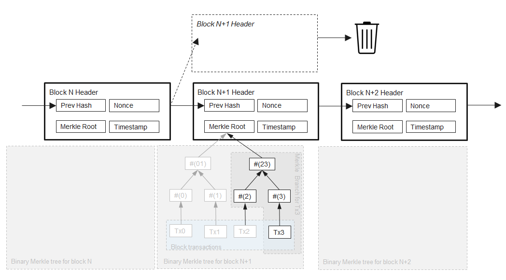
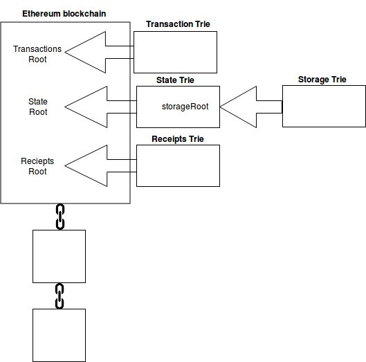
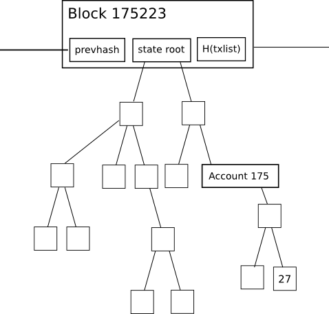
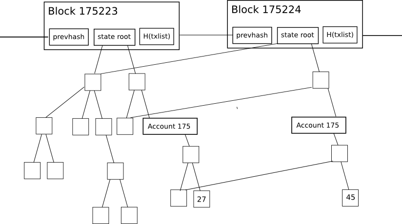
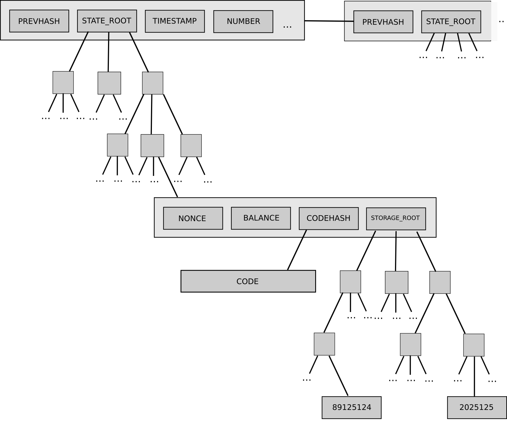

# Consensus

[Reference]

https://github.com/ethereumbook/ethereumbook/blob/develop/14consensus.asciidoc

https://ethereum.stackexchange.com/questions/268/ethereum-block-architecture

https://medium.com/cybermiles/diving-into-ethereums-world-state-c893102030ed

## POW vs POS

[Reference]

https://hackernoon.com/consensus-mechanisms-explained-pow-vs-pos-89951c66ae10

## Consensus via Proof of Work

 
## Ethash: Ethereum’s POW Algorithm 
Ethash is the Ethereum PoW algorithm. 

 메모리 기반의 이더리움 작업증명 알고리즘으로,컴퓨터 메모리상의 일정량의 데이타를 읽은후 이것을 nonce와 함께 hash 계산하는 방식을 반복합니다. 일반적으로 메모리를 읽고 복사하는 속도가 hash 연산보다 느리기 때문에 hash 연산력만 높이는 것은 작업증명에 큰 의미가 없어지게 됩니다. 따라서 ASIC 장비가 무력화되어 일반 PC에서 GPU를 사용한 마이닝이 가능하게 되었습니다. 이대시는 10~15초마다 새로운 블록이 생성되도록 설계되어 있으며, DAG 알고리즘을 사용합니다.
 

## Mining
[Reference]

https://github.com/ethereum/wiki/wiki/Patricia-Tree

https://github.com/ethereum/wiki/wiki/Ethereum-Development-Tutorial

## Merkle Patricia Trie

## Ethereum: Merkle Patricia Trie

[Reference]

https://blog.ethereum.org/2015/06/26/state-tree-pruning/

All of the merkle tries in Ethereum use a Merkle Patricia Trie.

From a block header there are 3 roots from 3 of these tries.

- stateRoot
- transactionsRoot
- receiptsRoot

- State Trie : 머클 페트리샤 트리, 이더리움 계정 정보
- Storage Trie
- Transactions Trie : 머클 트리, 트랜젝션 요청만에 대한 기록
- Receipts Trie : 머클 트리, 트랙젝션의 결과(output)만 기록

---

## Consensus via Proof of Stake (PoS)

## Casper: Ethereum’s POS Algorithm

 Ethereum’s planned PoS algorithm is called Casper. 