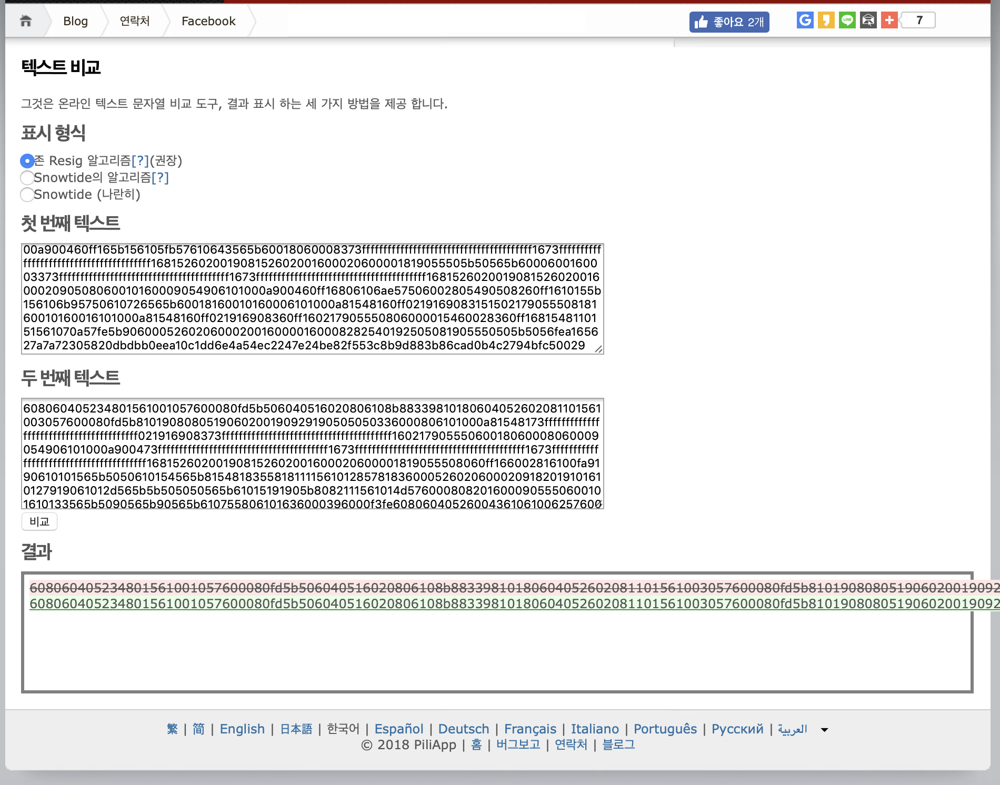

# Contract
[Reference]

[Contract Ethereum](
https://github.com/ethereum/go-ethereum/wiki/Contract-Tutorial)

https://developer.mozilla.org/ko/docs/Mozilla/Projects/Emscripten

## Install Solc

solc를 설치해보자.

```
vagrant@ubuntu-bionic:~$ sudo add-apt-repository ppa:ethereum/ethereum

 More info: https://launchpad.net/~ethereum/+archive/ubuntu/ethereum
Press [ENTER] to continue or Ctrl-c to cancel adding it.

Hit:1 http://archive.ubuntu.com/ubuntu bionic InRelease
Get:2 http://security.ubuntu.com/ubuntu bionic-security InRelease [83.2 kB]
Get:3 http://archive.ubuntu.com/ubuntu bionic-updates InRelease [88.7 kB]
Get:4 http://archive.ubuntu.com/ubuntu bionic-backports InRelease [74.6 kB]
Get:5 http://ppa.launchpad.net/ethereum/ethereum/ubuntu bionic InRelease [15.4 kB]
Get:6 http://ppa.launchpad.net/ethereum/ethereum/ubuntu bionic/main amd64 Packages [3324 B]
Get:7 http://ppa.launchpad.net/ethereum/ethereum/ubuntu bionic/main Translation-en [908 B]
Fetched 266 kB in 6s (46.1 kB/s)
Reading package lists... Done
```

```
vagrant@ubuntu-bionic:~$ sudo apt-get update
Hit:1 http://ppa.launchpad.net/ethereum/ethereum/ubuntu bionic InRelease
Get:2 http://security.ubuntu.com/ubuntu bionic-security InRelease [83.2 kB]
Hit:3 http://archive.ubuntu.com/ubuntu bionic InRelease
Get:4 http://archive.ubuntu.com/ubuntu bionic-updates InRelease [88.7 kB]
Get:5 http://archive.ubuntu.com/ubuntu bionic-backports InRelease [74.6 kB]
Fetched 247 kB in 2s (101 kB/s)
Reading package lists... Done
```

```
vagrant@ubuntu-bionic:~$ sudo apt-get install solc -y
Reading package lists... Done
Building dependency tree
Reading state information... Done
The following additional packages will be installed:
  libz3-4
The following NEW packages will be installed:
  libz3-4 solc
0 upgraded, 2 newly installed, 0 to remove and 123 not upgraded.
Need to get 6757 kB of archives.
After this operation, 22.6 MB of additional disk space will be used.
Get:1 http://archive.ubuntu.com/ubuntu bionic/universe amd64 libz3-4 amd64 4.4.1-0.3build4 [5183 kB]
Get:2 http://ppa.launchpad.net/ethereum/ethereum/ubuntu bionic/main amd64 solc amd64 1:0.5.0-0ubuntu1~bionic [1573 kB]
Fetched 6757 kB in 4s (1820 kB/s)
Selecting previously unselected package libz3-4:amd64.
(Reading database ... 66111 files and directories currently installed.)
Preparing to unpack .../libz3-4_4.4.1-0.3build4_amd64.deb ...
Unpacking libz3-4:amd64 (4.4.1-0.3build4) ...
Selecting previously unselected package solc:amd64.
Preparing to unpack .../solc_1%3a0.5.0-0ubuntu1~bionic_amd64.deb ...
Unpacking solc:amd64 (1:0.5.0-0ubuntu1~bionic) ...
Processing triggers for libc-bin (2.27-3ubuntu1) ...
Setting up libz3-4:amd64 (4.4.1-0.3build4) ...
Setting up solc:amd64 (1:0.5.0-0ubuntu1~bionic) ...
Processing triggers for libc-bin (2.27-3ubuntu1) ...
```

```
vagrant@ubuntu-bionic:~$ which solc
/usr/bin/solc
```


## Contract Compile

[Reference]

[solc](https://github.com/ethereum/aleth)

[solc compile version](http://www.realhanbit.co.kr/books/25/pages/288/preview)

[Why solc compile](http://wisefree.tistory.com/478)

[geth cmd](https://www.mrlatte.net/research/2018/02/27/ethereum-geth.html)

go-ethereum 1.6.0 이후 버전부터는 gethdptj rpc api로 솔리디티 컴파일러 solc를 호출해서 솔리디티 소스를 컴파일할 수가 없다. web3에서 제공하는 객체는 이더리움 노드의 코어 기능과 관련된 것들을 담당하는 데 solc 컴파일러 호출은 이 범위를 벗어 났기 때문에 기능을 삭제 했다고 한다.

```
vagrant@ubuntu-bionic:~$ geth attach --datadir ./test/
WARN [12-03|01:29:37.388] Sanitizing cache to Go's GC limits       provided=1024 updated=1000
Welcome to the Geth JavaScript console!

instance: Geth/v1.8.19-stable-dae82f09/linux-amd64/go1.10.4
 modules: admin:1.0 debug:1.0 eth:1.0 ethash:1.0 miner:1.0 net:1.0 personal:1.0 rpc:1.0 txpool:1.0 web3:1.0

> eth.getCompilers()
Error: The method eth_getCompilers does not exist/is not available
    at web3.js:3143:20
    at web3.js:6347:15
    at web3.js:5081:36
    at <anonymous>:1:1
```

```
vagrant@ubuntu-bionic:~$ geth attach --datadir ./test/
WARN [12-03|01:32:21.743] Sanitizing cache to Go's GC limits       provided=1024 updated=1000
Welcome to the Geth JavaScript console!

instance: Geth/v1.8.19-stable-dae82f09/linux-amd64/go1.10.4
 modules: admin:1.0 debug:1.0 eth:1.0 ethash:1.0 miner:1.0 net:1.0 personal:1.0 rpc:1.0 txpool:1.0 web3:1.0

> var greeterSource = 'contract mortal { address owner; function mortal() { owner = msg.sender; } function kill() { if (msg.sender == owner) suicide(owner); } } contract greeter is mortal { string greeting; function greeter(string _greeting) public { greeting = _greeting; } function greet() constant returns (string) { return greeting; } }'
undefined
>
> var greeterCompiled = web3.eth.compile.solidity(greeterSource)
Error: The method eth_compileSolidity does not exist/is not available
    at web3.js:3143:20
    at web3.js:6347:15
    at web3.js:5081:36
    at <anonymous>:1:23
```

remix-ide에서 제공하는 기본 예제를 이용했다.

```
vagrant@ubuntu-bionic:~$ solc --bin -o /tmp/solcoutput  contract.sol
vagrant@ubuntu-bionic:~$ ls /tmp/solcoutput -l
total 8
-rw-rw-r-- 1 vagrant vagrant 4464 Dec  3 01:38 Ballot.bin
vagrant@ubuntu-bionic:~$ cat /tmp/solcoutput/Ballot.bin
608060405234801561001057600080fd5b506040516020806108b88339810180604052602081101561003057600080fd5b8101908080519060200190929190505050336000806101000a81548173ffffffffffffffffffffffffffffffffffffffff021916908373ffffffffffffffffffffffffffffffffffffffff16021790555060018060008060009054906101000a900473ffffffffffffffffffffffffffffffffffffffff1673ffffffffffffffffffffffffffffffffffffffff1673ffffffffffffffffffffffffffffffffffffffff168152602001908152602001600020600001819055508060ff166002816100fa9190610101565b5050610154565b81548183558181111561012857818360005260206000209182019101610127919061012d565b5b505050565b61015191905b8082111561014d5760008082016000905550600101610133565b5090565b90565b610755806101636000396000f3fe608060405260043610610062576000357c0100000000000000000000000000000000000000000000000000000000900463ffffffff1680635c19a95c14610067578063609ff1bd146100b85780639e7b8d61146100e9578063b3f98adc1461013a575b600080fd5b34801561007357600080fd5b506100b66004803603602081101561008a57600080fd5b81019080803573ffffffffffffffffffffffffffffffffffffffff169060200190929190505050610178565b005b3480156100c457600080fd5b506100cd6104cd565b604051808260ff1660ff16815260200191505060405180910390f35b3480156100f557600080fd5b506101386004803603602081101561010c57600080fd5b81019080803573ffffffffffffffffffffffffffffffffffffffff169060200190929190505050610549565b005b34801561014657600080fd5b506101766004803603602081101561015d57600080fd5b81019080803560ff169060200190929190505050610646565b005b6000600160003373ffffffffffffffffffffffffffffffffffffffff1673ffffffffffffffffffffffffffffffffffffffff16815260200190815260200160002090508060010160009054906101000a900460ff16156101d857506104ca565b5b600073ffffffffffffffffffffffffffffffffffffffff16600160008473ffffffffffffffffffffffffffffffffffffffff1673ffffffffffffffffffffffffffffffffffffffff16815260200190815260200160002060010160029054906101000a900473ffffffffffffffffffffffffffffffffffffffff1673ffffffffffffffffffffffffffffffffffffffff161415801561030657503373ffffffffffffffffffffffffffffffffffffffff16600160008473ffffffffffffffffffffffffffffffffffffffff1673ffffffffffffffffffffffffffffffffffffffff16815260200190815260200160002060010160029054906101000a900473ffffffffffffffffffffffffffffffffffffffff1673ffffffffffffffffffffffffffffffffffffffff1614155b1561037557600160008373ffffffffffffffffffffffffffffffffffffffff1673ffffffffffffffffffffffffffffffffffffffff16815260200190815260200160002060010160029054906101000a900473ffffffffffffffffffffffffffffffffffffffff1691506101d9565b3373ffffffffffffffffffffffffffffffffffffffff168273ffffffffffffffffffffffffffffffffffffffff1614156103af57506104ca565b60018160010160006101000a81548160ff021916908315150217905550818160010160026101000a81548173ffffffffffffffffffffffffffffffffffffffff021916908373ffffffffffffffffffffffffffffffffffffffff1602179055506000600160008473ffffffffffffffffffffffffffffffffffffffff1673ffffffffffffffffffffffffffffffffffffffff16815260200190815260200160002090508060010160009054906101000a900460ff16156104b057816000015460028260010160019054906101000a900460ff1660ff1681548110151561049157fe5b90600052602060002001600001600082825401925050819055506104c7565b816000015481600001600082825401925050819055505b50505b50565b6000806000905060008090505b6002805490508160ff161015610544578160028260ff168154811015156104fd57fe5b906000526020600020016000015411156105375760028160ff1681548110151561052357fe5b906000526020600020016000015491508092505b80806001019150506104da565b505090565b6000809054906101000a900473ffffffffffffffffffffffffffffffffffffffff1673ffffffffffffffffffffffffffffffffffffffff163373ffffffffffffffffffffffffffffffffffffffff161415806105f15750600160008273ffffffffffffffffffffffffffffffffffffffff1673ffffffffffffffffffffffffffffffffffffffff16815260200190815260200160002060010160009054906101000a900460ff165b156105fb57610643565b60018060008373ffffffffffffffffffffffffffffffffffffffff1673ffffffffffffffffffffffffffffffffffffffff168152602001908152602001600020600001819055505b50565b6000600160003373ffffffffffffffffffffffffffffffffffffffff1673ffffffffffffffffffffffffffffffffffffffff16815260200190815260200160002090508060010160009054906101000a900460ff16806106ae57506002805490508260ff1610155b156106b95750610726565b60018160010160006101000a81548160ff021916908315150217905550818160010160016101000a81548160ff021916908360ff160217905550806000015460028360ff1681548110151561070a57fe5b9060005260206000200160000160008282540192505081905550505b5056fea165627a7a72305820dbdbb0eea10c1dd6e4a54ec2247e24be82f553c8b9d883b86cad0b4c2794bfc50029
```

```
vagrant@ubuntu-bionic:~$ geth --rpc --rpcaddr "0.0.0.0" --rpcport "8545" --rpccorsdomain "*" --rpcapi "web3,eth" --testnet
```

Passphrase : linux
```
vagrant@ubuntu-bionic:~$ geth account new
WARN [12-03|02:37:53.820] Sanitizing cache to Go's GC limits       provided=1024 updated=1000
INFO [12-03|02:37:53.821] Maximum peer count                       ETH=25 LES=0 total=25
Your new account is locked with a password. Please give a password. Do not forget this password.
Passphrase:
Repeat passphrase:
Address: {dd06d1e04eeb08d84b454fc94e84b57dffc47c5d}
```

```json
{
    "config" : {
        "chainId" : 15,
        "homesteadBlock": 0,
        "eip155Block": 0,
        "eip158Block": 0
    },
    "difficulty": "200000000",
    "gasLimit" : "2100000",
    "alloc" : {
        "d88bd09fbd4115e0a114418918f0284ef8581666" : {
            "balance" : "300000000000000000000000"
        }
    }
}
```

```
vagrant@ubuntu-bionic:~$ geth --datadir ./data init CustomGenesis.json
WARN [12-03|02:41:30.951] Sanitizing cache to Go's GC limits       provided=1024 updated=1000
INFO [12-03|02:41:30.952] Maximum peer count                       ETH=25 LES=0 total=25
INFO [12-03|02:41:30.952] Allocated cache and file handles         database=/home/vagrant/data/geth/chaindata cache=16 handles=16
INFO [12-03|02:41:30.964] Writing custom genesis block
INFO [12-03|02:41:30.964] Persisted trie from memory database      nodes=1 size=150.00B time=67.104µs gcnodes=0 gcsize=0.00B gctime=0s livenodes=1 livesize=0.00B
INFO [12-03|02:41:30.965] Successfully wrote genesis state         database=chaindata                         hash=559f83…bc4e8d
INFO [12-03|02:41:30.965] Allocated cache and file handles         database=/home/vagrant/data/geth/lightchaindata cache=16 handles=16
INFO [12-03|02:41:30.982] Writing custom genesis block
INFO [12-03|02:41:30.982] Persisted trie from memory database      nodes=1 size=150.00B time=45.975µs gcnodes=0 gcsize=0.00B gctime=0s livenodes=1 livesize=0.00B
INFO [12-03|02:41:30.983] Successfully wrote genesis state         database=lightchaindata                         hash=559f83…bc4e8d
```

```
Welcome to the Geth JavaScript console!

instance: Geth/v1.8.19-stable-dae82f09/linux-amd64/go1.10.4
coinbase: 0xdd06d1e04eeb08d84b454fc94e84b57dffc47c5d
at block: 0 (Thu, 01 Jan 1970 00:00:00 UTC)
 datadir: /home/vagrant/data
 modules: admin:1.0 debug:1.0 eth:1.0 ethash:1.0 miner:1.0 net:1.0 personal:1.0 rpc:1.0 txpool:1.0 web3:1.0

> eth.accounts
["0xd88bd09fbd4115e0a114418918f0284ef8581666"]
> INFO [12-03|03:02:02.980] New local node record                    seq=2 id=6758ae977a99c7eb ip=175.203.23.202 udp=58573 tcp=30303
> personal.unlockAccount(eth.accounts[0])
Unlock account 0xd88bd09fbd4115e0a114418918f0284ef8581666
Passphrase:
true
```


```
> eth.pendingTransactions
[{
    blockHash: null,
    blockNumber: null,
    from: "0xd88bd09fbd4115e0a114418918f0284ef8581666",
    gas: 605235,
    gasPrice: 1000000000,
    hash: "0xfe5c0f0cb4e231c89efe3ffdc703adfae024c83c19064c31777497a5da6150d3",
    input: "0x608060405234801561001057600080fd5b5060405160208061087c83398101806040528101908080519060200190929190505050336000806101000a81548173ffffffffffffffffffffffffffffffffffffffff021916908373ffffffffffffffffffffffffffffffffffffffff16021790555060018060008060009054906101000a900473ffffffffffffffffffffffffffffffffffffffff1673ffffffffffffffffffffffffffffffffffffffff1673ffffffffffffffffffffffffffffffffffffffff168152602001908152602001600020600001819055508060ff166002816100ec91906100f3565b5050610146565b81548183558181111561011a57818360005260206000209182019101610119919061011f565b5b505050565b61014391905b8082111561013f5760008082016000905550600101610125565b5090565b90565b610727806101556000396000f300608060405260043610610062576000357c0100000000000000000000000000000000000000000000000000000000900463ffffffff1680635c19a95c14610067578063609ff1bd146100aa5780639e7b8d61146100db578063b3f98adc1461011e575b600080fd5b34801561007357600080fd5b506100a8600480360381019080803573ffffffffffffffffffffffffffffffffffffffff16906020019092919050505061014e565b005b3480156100b657600080fd5b506100bf6104a0565b604051808260ff1660ff16815260200191505060405180910390f35b3480156100e757600080fd5b5061011c600480360381019080803573ffffffffffffffffffffffffffffffffffffffff16906020019092919050505061051c565b005b34801561012a57600080fd5b5061014c600480360381019080803560ff169060200190929190505050610619565b005b600080600160003373ffffffffffffffffffffffffffffffffffffffff1673ffffffffffffffffffffffffffffffffffffffff16815260200190815260200160002091508160010160009054906101000a900460ff16156101ae5761049b565b5b600073ffffffffffffffffffffffffffffffffffffffff16600160008573ffffffffffffffffffffffffffffffffffffffff1673ffffffffffffffffffffffffffffffffffffffff16815260200190815260200160002060010160029054906101000a900473ffffffffffffffffffffffffffffffffffffffff1673ffffffffffffffffffffffffffffffffffffffff16141580156102dc57503373ffffffffffffffffffffffffffffffffffffffff16600160008573ffffffffffffffffffffffffffffffffffffffff1673ffffffffffffffffffffffffffffffffffffffff16815260200190815260200160002060010160029054906101000a900473ffffffffffffffffffffffffffffffffffffffff1673ffffffffffffffffffffffffffffffffffffffff1614155b1561034b57600160008473ffffffffffffffffffffffffffffffffffffffff1673ffffffffffffffffffffffffffffffffffffffff16815260200190815260200160002060010160029054906101000a900473ffffffffffffffffffffffffffffffffffffffff1692506101af565b3373ffffffffffffffffffffffffffffffffffffffff168373ffffffffffffffffffffffffffffffffffffffff1614156103845761049b565b60018260010160006101000a81548160ff021916908315150217905550828260010160026101000a81548173ffffffffffffffffffffffffffffffffffffffff021916908373ffffffffffffffffffffffffffffffffffffffff160217905550600160008473ffffffffffffffffffffffffffffffffffffffff1673ffffffffffffffffffffffffffffffffffffffff16815260200190815260200160002090508060010160009054906101000a900460ff161561048357816000015460028260010160019054906101000a900460ff1660ff1681548110151561046457fe5b906000526020600020016000016000828254019250508190555061049a565b816000015481600001600082825401925050819055505b5b505050565b6000806000809150600090505b6002805490508160ff161015610517578160028260ff168154811015156104d057fe5b9060005260206000200160000154111561050a5760028160ff168154811015156104f657fe5b906000526020600020016000015491508092505b80806001019150506104ad565b505090565b6000809054906101000a900473ffffffffffffffffffffffffffffffffffffffff1673ffffffffffffffffffffffffffffffffffffffff163373ffffffffffffffffffffffffffffffffffffffff161415806105c45750600160008273ffffffffffffffffffffffffffffffffffffffff1673ffffffffffffffffffffffffffffffffffffffff16815260200190815260200160002060010160009054906101000a900460ff165b156105ce57610616565b60018060008373ffffffffffffffffffffffffffffffffffffffff1673ffffffffffffffffffffffffffffffffffffffff168152602001908152602001600020600001819055505b50565b6000600160003373ffffffffffffffffffffffffffffffffffffffff1673ffffffffffffffffffffffffffffffffffffffff16815260200190815260200160002090508060010160009054906101000a900460ff168061068157506002805490508260ff1610155b1561068b576106f7565b60018160010160006101000a81548160ff021916908315150217905550818160010160016101000a81548160ff021916908360ff160217905550806000015460028360ff168154811015156106dc57fe5b90600052602060002001600001600082825401925050819055505b50505600a165627a7a723058202f1f4eef1f80eb2f1e5797f47cc8a313e6208fe38556be9fffc33d3da373f8db00290000000000000000000000000000000000000000000000000000000000000000",
    nonce: 0,
    r: "0xe13e76ad858a7fc5ff964fef46c9ec4b12ca3832d1c73a8cf52ffc7ce1fb19b",
    s: "0x5cdfbe3c18d213c4ce2548d600c79b950bfcf6ece64d2a9038a5cc95514171e8",
    to: null,
    transactionIndex: 0,
    v: "0x41",
    value: 0
}]
```


https://kr.piliapp.com/text-diff/#diff

```
vagrant@ubuntu-bionic:~$ solc --version
solc, the solidity compiler commandline interface
Version: 0.5.0+commit.1d4f565a.Linux.g++
```

remix-ide solc version
```0.5.0-nightly.2018.11.13+commit.ac980fb8```





