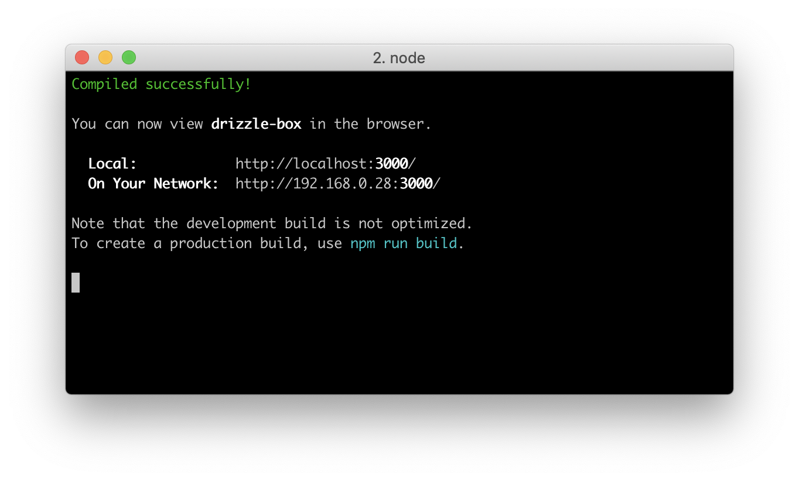

# Drizzle

[Reference]

[drizzle-overview]
(https://truffleframework.com/docs/drizzle/overview)

[drizzle-getting-started]
(https://truffleframework.com/docs/drizzle/getting-started/contract-interaction)

[the-right-way-to-develop-your-ethereum-dapp-is-here-drizzle](https://medium.com/@Niharika3297/the-right-way-to-develop-your-ethereum-dapp-is-here-drizzle-a633af45f031)


Drizzle은 front-end 라이브러리 콜랙션이다. 이더리움 web3 인터페이스와 front 부분은 react로 구성되어 있다.


## Drizzle HelloWorld

truffle 과 ganache-cli를 설치한다. (필자는 그냥 gui로 했다.)

```
$ npm install -g truffle
$ npm install -g ganache-cli
```

drizzle 예제 다운로드 해본다.

```
$ truffle unbox drizzle
```

에러가 난다..

```
$ truffle unbox drizzle
Downloading...
Unpacking...
Setting up...
Error: Command failed: npm install
gyp WARN download NVM_NODEJS_ORG_MIRROR is deprecated and will be removed in node-gyp v4, please use NODEJS_ORG_MIRROR
gyp WARN download NVM_NODEJS_ORG_MIRROR is deprecated and will be removed in node-gyp v4, please use NODEJS_ORG_MIRROR
gyp WARN download NVM_NODEJS_ORG_MIRROR is deprecated and will be removed in node-gyp v4, please use NODEJS_ORG_MIRROR
../src/libkeccak/KeccakP-1600-reference.c:231:13: warning: unused function 'fromBytesToWords' [-Wunused-function]
static void fromBytesToWords(tKeccakLane *stateAsWords, const unsigned char *state)
            ^
../src/libkeccak/KeccakP-1600-reference.c:242:13: warning: unused function 'fromWordsToBytes' [-Wunused-function]
static void fromWordsToBytes(unsigned char *state, const tKeccakLane *stateAsWords)
            ^
2 warnings generated.
gyp WARN download NVM_NODEJS_ORG_MIRROR is deprecated and will be removed in node-gyp v4, please use NODEJS_ORG_MIRROR
gyp WARN download NVM_NODEJS_ORG_MIRROR is deprecated and will be removed in node-gyp v4, please use NODEJS_ORG_MIRROR
gyp WARN download NVM_NODEJS_ORG_MIRROR is deprecated and will be removed in node-gyp v4, please use NODEJS_ORG_MIRROR
In file included from ../src/node-boilerplate/scrypt_params_async.cc:4:
In file included from ../src/node-boilerplate/inc/scrypt_params_async.h:28:
../src/node-boilerplate/inc/scrypt_async.h:53:17: warning: 'Call' is deprecated [-Wdeprecated-declarations]
      callback->Call(1, argv);
                ^
../../nan/nan.h:1617:3: note: 'Call' has been explicitly marked deprecated here
  NAN_DEPRECATED inline v8::Local<v8::Value>
  ^
../../nan/nan.h:98:40: note: expanded from macro 'NAN_DEPRECATED'
# define NAN_DEPRECATED __attribute__((deprecated))
                                       ^
../src/node-boilerplate/scrypt_params_async.cc:32:13: warning: 'Call' is deprecated [-Wdeprecated-declarations]
  callback->Call(2, argv);
            ^
../../nan/nan.h:1617:3: note: 'Call' has been explicitly marked deprecated here
  NAN_DEPRECATED inline v8::Local<v8::Value>
  ^
../../nan/nan.h:98:40: note: expanded from macro 'NAN_DEPRECATED'
# define NAN_DEPRECATED __attribute__((deprecated))
                                       ^
2 warnings generated.
In file included from ../src/node-boilerplate/scrypt_kdf_async.cc:4:
In file included from ../src/node-boilerplate/inc/scrypt_kdf_async.h:28:
../src/node-boilerplate/inc/scrypt_async.h:53:17: warning: 'Call' is deprecated [-Wdeprecated-declarations]
      callback->Call(1, argv);
                ^
../../nan/nan.h:1617:3: note: 'Call' has been explicitly marked deprecated here
  NAN_DEPRECATED inline v8::Local<v8::Value>
  ^
../../nan/nan.h:98:40: note: expanded from macro 'NAN_DEPRECATED'
# define NAN_DEPRECATED __attribute__((deprecated))
                                       ^
../src/node-boilerplate/scrypt_kdf_async.cc:28:15: warning: 'Call' is deprecated [-Wdeprecated-declarations]
    callback->Call(2, argv);
              ^
../../nan/nan.h:1617:3: note: 'Call' has been explicitly marked deprecated here
  NAN_DEPRECATED inline v8::Local<v8::Value>
  ^
../../nan/nan.h:98:40: note: expanded from macro 'NAN_DEPRECATED'
# define NAN_DEPRECATED __attribute__((deprecated))
                                       ^
2 warnings generated.
In file included from ../src/node-boilerplate/scrypt_kdf-verify_async.cc:4:
In file included from ../src/node-boilerplate/inc/scrypt_kdf-verify_async.h:28:
../src/node-boilerplate/inc/scrypt_async.h:53:17: warning: 'Call' is deprecated [-Wdeprecated-declarations]
      callback->Call(1, argv);
                ^
../../nan/nan.h:1617:3: note: 'Call' has been explicitly marked deprecated here
  NAN_DEPRECATED inline v8::Local<v8::Value>
  ^
../../nan/nan.h:98:40: note: expanded from macro 'NAN_DEPRECATED'
# define NAN_DEPRECATED __attribute__((deprecated))
                                       ^
../src/node-boilerplate/scrypt_kdf-verify_async.cc:30:13: warning: 'Call' is deprecated [-Wdeprecated-declarations]
  callback->Call(2, argv);
            ^
../../nan/nan.h:1617:3: note: 'Call' has been explicitly marked deprecated here
  NAN_DEPRECATED inline v8::Local<v8::Value>
  ^
../../nan/nan.h:98:40: note: expanded from macro 'NAN_DEPRECATED'
# define NAN_DEPRECATED __attribute__((deprecated))
                                       ^
2 warnings generated.
In file included from ../src/node-boilerplate/scrypt_hash_async.cc:28:
In file included from ../src/node-boilerplate/inc/scrypt_hash_async.h:28:
../src/node-boilerplate/inc/scrypt_async.h:53:17: warning: 'Call' is deprecated [-Wdeprecated-declarations]
      callback->Call(1, argv);
                ^
../../nan/nan.h:1617:3: note: 'Call' has been explicitly marked deprecated here
  NAN_DEPRECATED inline v8::Local<v8::Value>
  ^
../../nan/nan.h:98:40: note: expanded from macro 'NAN_DEPRECATED'
# define NAN_DEPRECATED __attribute__((deprecated))
                                       ^
../src/node-boilerplate/scrypt_hash_async.cc:52:13: warning: 'Call' is deprecated [-Wdeprecated-declarations]
  callback->Call(2, argv);
            ^
../../nan/nan.h:1617:3: note: 'Call' has been explicitly marked deprecated here
  NAN_DEPRECATED inline v8::Local<v8::Value>
  ^
../../nan/nan.h:98:40: note: expanded from macro 'NAN_DEPRECATED'
# define NAN_DEPRECATED __attribute__((deprecated))
                                       ^
2 warnings generated.
gyp WARN download NVM_NODEJS_ORG_MIRROR is deprecated and will be removed in node-gyp v4, please use NODEJS_ORG_MIRROR
gyp WARN download NVM_NODEJS_ORG_MIRROR is deprecated and will be removed in node-gyp v4, please use NODEJS_ORG_MIRROR
gyp WARN download NVM_NODEJS_ORG_MIRROR is deprecated and will be removed in node-gyp v4, please use NODEJS_ORG_MIRROR
../src/privatekey.cc:73:3: warning: ignoring return value of function declared with 'warn_unused_result' attribute [-Wunused-result]
  secp256k1_ec_privkey_negate(secp256k1ctx, &private_key[0]);
  ^~~~~~~~~~~~~~~~~~~~~~~~~~~ ~~~~~~~~~~~~~~~~~~~~~~~~~~~~~
In file included from ../src/privatekey.cc:4:
In file included from ../src/secp256k1-src/src/scalar_impl.h:10:
In file included from ../src/secp256k1-src/src/group.h:11:
../src/secp256k1-src/src/field.h:36:13: warning: unused function 'secp256k1_fe_normalize' [-Wunused-function]
static void secp256k1_fe_normalize(secp256k1_fe *r);
            ^
../src/secp256k1-src/src/field.h:39:13: warning: unused function 'secp256k1_fe_normalize_weak' [-Wunused-function]
static void secp256k1_fe_normalize_weak(secp256k1_fe *r);
            ^
../src/secp256k1-src/src/field.h:42:13: warning: unused function 'secp256k1_fe_normalize_var' [-Wunused-function]
static void secp256k1_fe_normalize_var(secp256k1_fe *r);
            ^
../src/secp256k1-src/src/field.h:46:12: warning: unused function 'secp256k1_fe_normalizes_to_zero' [-Wunused-function]
static int secp256k1_fe_normalizes_to_zero(secp256k1_fe *r);
           ^
../src/secp256k1-src/src/field.h:50:12: warning: unused function 'secp256k1_fe_normalizes_to_zero_var' [-Wunused-function]
static int secp256k1_fe_normalizes_to_zero_var(secp256k1_fe *r);
           ^
../src/secp256k1-src/src/field.h:53:13: warning: unused function 'secp256k1_fe_set_int' [-Wunused-function]
static void secp256k1_fe_set_int(secp256k1_fe *r, int a);
            ^
../src/secp256k1-src/src/field.h:56:13: warning: unused function 'secp256k1_fe_clear' [-Wunused-function]
static void secp256k1_fe_clear(secp256k1_fe *a);
            ^
../src/secp256k1-src/src/field.h:59:12: warning: unused function 'secp256k1_fe_is_zero' [-Wunused-function]
static int secp256k1_fe_is_zero(const secp256k1_fe *a);
           ^
../src/secp256k1-src/src/field.h:62:12: warning: unused function 'secp256k1_fe_is_odd' [-Wunused-function]
static int secp256k1_fe_is_odd(const secp256k1_fe *a);
           ^
../src/secp256k1-src/src/field.h:65:12: warning: unused function 'secp256k1_fe_equal' [-Wunused-function]
static int secp256k1_fe_equal(const secp256k1_fe *a, const secp256k1_fe *b);
           ^
../src/secp256k1-src/src/field.h:68:12: warning: unused function 'secp256k1_fe_equal_var' [-Wunused-function]
static int secp256k1_fe_equal_var(const secp256k1_fe *a, const secp256k1_fe *b);
           ^
../src/secp256k1-src/src/field.h:71:12: warning: unused function 'secp256k1_fe_cmp_var' [-Wunused-function]
static int secp256k1_fe_cmp_var(const secp256k1_fe *a, const secp256k1_fe *b);
           ^
../src/secp256k1-src/src/field.h:74:12: warning: unused function 'secp256k1_fe_set_b32' [-Wunused-function]
static int secp256k1_fe_set_b32(secp256k1_fe *r, const unsigned char *a);
           ^
../src/secp256k1-src/src/field.h:77:13: warning: unused function 'secp256k1_fe_get_b32' [-Wunused-function]
static void secp256k1_fe_get_b32(unsigned char *r, const secp256k1_fe *a);
            ^
../src/secp256k1-src/src/field.h:81:13: warning: unused function 'secp256k1_fe_negate' [-Wunused-function]
static void secp256k1_fe_negate(secp256k1_fe *r, const secp256k1_fe *a, int m);
            ^
../src/secp256k1-src/src/field.h:85:13: warning: unused function 'secp256k1_fe_mul_int' [-Wunused-function]
static void secp256k1_fe_mul_int(secp256k1_fe *r, int a);
            ^
../src/secp256k1-src/src/field.h:88:13: warning: unused function 'secp256k1_fe_add' [-Wunused-function]
static void secp256k1_fe_add(secp256k1_fe *r, const secp256k1_fe *a);
            ^
../src/secp256k1-src/src/field.h:92:13: warning: unused function 'secp256k1_fe_mul' [-Wunused-function]
static void secp256k1_fe_mul(secp256k1_fe *r, const secp256k1_fe *a, const secp256k1_fe * SECP256K1_RESTRICT b);
            ^
../src/secp256k1-src/src/field.h:96:13: warning: unused function 'secp256k1_fe_sqr' [-Wunused-function]
static void secp256k1_fe_sqr(secp256k1_fe *r, const secp256k1_fe *a);
            ^
../src/secp256k1-src/src/field.h:103:12: warning: unused function 'secp256k1_fe_sqrt' [-Wunused-function]
static int secp256k1_fe_sqrt(secp256k1_fe *r, const secp256k1_fe *a);
           ^
../src/secp256k1-src/src/field.h:106:12: warning: unused function 'secp256k1_fe_is_quad_var' [-Wunused-function]
static int secp256k1_fe_is_quad_var(const secp256k1_fe *a);
           ^
../src/secp256k1-src/src/field.h:110:13: warning: unused function 'secp256k1_fe_inv' [-Wunused-function]
static void secp256k1_fe_inv(secp256k1_fe *r, const secp256k1_fe *a);
            ^
../src/secp256k1-src/src/field.h:113:13: warning: unused function 'secp256k1_fe_inv_var' [-Wunused-function]
static void secp256k1_fe_inv_var(secp256k1_fe *r, const secp256k1_fe *a);
            ^
../src/secp256k1-src/src/field.h:118:13: warning: unused function 'secp256k1_fe_inv_all_var' [-Wunused-function]
static void secp256k1_fe_inv_all_var(secp256k1_fe *r, const secp256k1_fe *a, size_t len);
            ^
../src/secp256k1-src/src/field.h:121:13: warning: unused function 'secp256k1_fe_to_storage' [-Wunused-function]
static void secp256k1_fe_to_storage(secp256k1_fe_storage *r, const secp256k1_fe *a);
            ^
../src/secp256k1-src/src/field.h:124:13: warning: unused function 'secp256k1_fe_from_storage' [-Wunused-function]
static void secp256k1_fe_from_storage(secp256k1_fe *r, const secp256k1_fe_storage *a);
            ^
../src/secp256k1-src/src/field.h:127:13: warning: unused function 'secp256k1_fe_storage_cmov' [-Wunused-function]
static void secp256k1_fe_storage_cmov(secp256k1_fe_storage *r, const secp256k1_fe_storage *a, int flag);
            ^
../src/secp256k1-src/src/field.h:130:13: warning: unused function 'secp256k1_fe_cmov' [-Wunused-function]
static void secp256k1_fe_cmov(secp256k1_fe *r, const secp256k1_fe *a, int flag);
            ^
In file included from ../src/privatekey.cc:4:
In file included from ../src/secp256k1-src/src/scalar_impl.h:10:
../src/secp256k1-src/src/group.h:44:13: warning: unused function 'secp256k1_ge_set_xy' [-Wunused-function]
static void secp256k1_ge_set_xy(secp256k1_ge *r, const secp256k1_fe *x, const secp256k1_fe *y);
            ^
../src/secp256k1-src/src/group.h:50:12: warning: unused function 'secp256k1_ge_set_xquad' [-Wunused-function]
static int secp256k1_ge_set_xquad(secp256k1_ge *r, const secp256k1_fe *x);
           ^
../src/secp256k1-src/src/group.h:54:12: warning: unused function 'secp256k1_ge_set_xo_var' [-Wunused-function]
static int secp256k1_ge_set_xo_var(secp256k1_ge *r, const secp256k1_fe *x, int odd);
           ^
../src/secp256k1-src/src/group.h:57:12: warning: unused function 'secp256k1_ge_is_infinity' [-Wunused-function]
static int secp256k1_ge_is_infinity(const secp256k1_ge *a);
           ^
../src/secp256k1-src/src/group.h:60:12: warning: unused function 'secp256k1_ge_is_valid_var' [-Wunused-function]
static int secp256k1_ge_is_valid_var(const secp256k1_ge *a);
           ^
../src/secp256k1-src/src/group.h:62:13: warning: unused function 'secp256k1_ge_neg' [-Wunused-function]
static void secp256k1_ge_neg(secp256k1_ge *r, const secp256k1_ge *a);
            ^
../src/secp256k1-src/src/group.h:65:13: warning: unused function 'secp256k1_ge_set_gej' [-Wunused-function]
static void secp256k1_ge_set_gej(secp256k1_ge *r, secp256k1_gej *a);
            ^
../src/secp256k1-src/src/group.h:68:13: warning: unused function 'secp256k1_ge_set_all_gej_var' [-Wunused-function]
static void secp256k1_ge_set_all_gej_var(secp256k1_ge *r, const secp256k1_gej *a, size_t len, const secp256k1_callback *cb);
            ^
../src/secp256k1-src/src/group.h:73:13: warning: unused function 'secp256k1_ge_set_table_gej_var' [-Wunused-function]
static void secp256k1_ge_set_table_gej_var(secp256k1_ge *r, const secp256k1_gej *a, const secp256k1_fe *zr, size_t len);
            ^
../src/secp256k1-src/src/group.h:80:13: warning: unused function 'secp256k1_ge_globalz_set_table_gej' [-Wunused-function]
static void secp256k1_ge_globalz_set_table_gej(size_t len, secp256k1_ge *r, secp256k1_fe *globalz, const secp256k1_gej *a, const secp256k1_fe *zr);
            ^
../src/secp256k1-src/src/group.h:83:13: warning: unused function 'secp256k1_gej_set_infinity' [-Wunused-function]
static void secp256k1_gej_set_infinity(secp256k1_gej *r);
            ^
../src/secp256k1-src/src/group.h:86:13: warning: unused function 'secp256k1_gej_set_ge' [-Wunused-function]
static void secp256k1_gej_set_ge(secp256k1_gej *r, const secp256k1_ge *a);
            ^
../src/secp256k1-src/src/group.h:89:12: warning: unused function 'secp256k1_gej_eq_x_var' [-Wunused-function]
static int secp256k1_gej_eq_x_var(const secp256k1_fe *x, const secp256k1_gej *a);
           ^
../src/secp256k1-src/src/group.h:92:13: warning: unused function 'secp256k1_gej_neg' [-Wunused-function]
static void secp256k1_gej_neg(secp256k1_gej *r, const secp256k1_gej *a);
            ^
../src/secp256k1-src/src/group.h:95:12: warning: unused function 'secp256k1_gej_is_infinity' [-Wunused-function]
static int secp256k1_gej_is_infinity(const secp256k1_gej *a);
           ^
../src/secp256k1-src/src/group.h:98:12: warning: unused function 'secp256k1_gej_has_quad_y_var' [-Wunused-function]
static int secp256k1_gej_has_quad_y_var(const secp256k1_gej *a);
           ^
../src/secp256k1-src/src/group.h:102:13: warning: unused function 'secp256k1_gej_double_nonzero' [-Wunused-function]
static void secp256k1_gej_double_nonzero(secp256k1_gej *r, const secp256k1_gej *a, secp256k1_fe *rzr);
            ^
../src/secp256k1-src/src/group.h:105:13: warning: unused function 'secp256k1_gej_double_var' [-Wunused-function]
static void secp256k1_gej_double_var(secp256k1_gej *r, const secp256k1_gej *a, secp256k1_fe *rzr);
            ^
../src/secp256k1-src/src/group.h:108:13: warning: unused function 'secp256k1_gej_add_var' [-Wunused-function]
static void secp256k1_gej_add_var(secp256k1_gej *r, const secp256k1_gej *a, const secp256k1_gej *b, secp256k1_fe *rzr);
            ^
../src/secp256k1-src/src/group.h:111:13: warning: unused function 'secp256k1_gej_add_ge' [-Wunused-function]
static void secp256k1_gej_add_ge(secp256k1_gej *r, const secp256k1_gej *a, const secp256k1_ge *b);
            ^
../src/secp256k1-src/src/group.h:116:13: warning: unused function 'secp256k1_gej_add_ge_var' [-Wunused-function]
static void secp256k1_gej_add_ge_var(secp256k1_gej *r, const secp256k1_gej *a, const secp256k1_ge *b, secp256k1_fe *rzr);
            ^
../src/secp256k1-src/src/group.h:119:13: warning: unused function 'secp256k1_gej_add_zinv_var' [-Wunused-function]
static void secp256k1_gej_add_zinv_var(secp256k1_gej *r, const secp256k1_gej *a, const secp256k1_ge *b, const secp256k1_fe *bzinv);
            ^
../src/secp256k1-src/src/group.h:127:13: warning: unused function 'secp256k1_gej_clear' [-Wunused-function]
static void secp256k1_gej_clear(secp256k1_gej *r);
            ^
../src/secp256k1-src/src/group.h:130:13: warning: unused function 'secp256k1_ge_clear' [-Wunused-function]
static void secp256k1_ge_clear(secp256k1_ge *r);
            ^
../src/secp256k1-src/src/group.h:133:13: warning: unused function 'secp256k1_ge_to_storage' [-Wunused-function]
static void secp256k1_ge_to_storage(secp256k1_ge_storage *r, const secp256k1_ge *a);
            ^
../src/secp256k1-src/src/group.h:136:13: warning: unused function 'secp256k1_ge_from_storage' [-Wunused-function]
static void secp256k1_ge_from_storage(secp256k1_ge *r, const secp256k1_ge_storage *a);
            ^
../src/secp256k1-src/src/group.h:139:13: warning: unused function 'secp256k1_ge_storage_cmov' [-Wunused-function]
static void secp256k1_ge_storage_cmov(secp256k1_ge_storage *r, const secp256k1_ge_storage *a, int flag);
            ^
../src/secp256k1-src/src/group.h:142:13: warning: unused function 'secp256k1_gej_rescale' [-Wunused-function]
static void secp256k1_gej_rescale(secp256k1_gej *r, const secp256k1_fe *b);
            ^
In file included from ../src/privatekey.cc:4:
In file included from ../src/secp256k1-src/src/scalar_impl.h:20:
../src/secp256k1-src/src/scalar_4x64_impl.h:83:12: warning: unused function 'secp256k1_scalar_add' [-Wunused-function]
static int secp256k1_scalar_add(secp256k1_scalar *r, const secp256k1_scalar *a, const secp256k1_scalar *b) {
           ^
../src/secp256k1-src/src/scalar_4x64_impl.h:897:12: warning: unused function 'secp256k1_scalar_shr_int' [-Wunused-function]
static int secp256k1_scalar_shr_int(secp256k1_scalar *r, int n) {
           ^
In file included from ../src/privatekey.cc:4:
../src/secp256k1-src/src/scalar_impl.h:225:13: warning: unused function 'secp256k1_scalar_inverse_var' [-Wunused-function]
static void secp256k1_scalar_inverse_var(secp256k1_scalar *r, const secp256k1_scalar *x) {
            ^
In file included from ../src/privatekey.cc:4:
In file included from ../src/secp256k1-src/src/scalar_impl.h:20:
../src/secp256k1-src/src/scalar_4x64_impl.h:140:13: warning: unused function 'secp256k1_scalar_negate' [-Wunused-function]
static void secp256k1_scalar_negate(secp256k1_scalar *r, const secp256k1_scalar *a) {
            ^
../src/secp256k1-src/src/scalar_4x64_impl.h:156:12: warning: unused function 'secp256k1_scalar_is_high' [-Wunused-function]
static int secp256k1_scalar_is_high(const secp256k1_scalar *a) {
           ^
../src/secp256k1-src/src/scalar_4x64_impl.h:168:12: warning: unused function 'secp256k1_scalar_cond_negate' [-Wunused-function]
static int secp256k1_scalar_cond_negate(secp256k1_scalar *r, int flag) {
           ^
63 warnings generated.
In file included from ../src/ecdh.cc:5:
In file included from ../src/secp256k1-src/src/field_impl.h:19:
../src/secp256k1-src/src/field_5x52_impl.h:267:12: warning: unused function 'secp256k1_fe_cmp_var' [-Wunused-function]
static int secp256k1_fe_cmp_var(const secp256k1_fe *a, const secp256k1_fe *b) {
           ^
In file included from ../src/ecdh.cc:7:
../src/secp256k1-src/src/group_impl.h:287:12: warning: unused function 'secp256k1_ge_is_valid_var' [-Wunused-function]
static int secp256k1_ge_is_valid_var(const secp256k1_ge *a) {
           ^
../src/secp256k1-src/src/group_impl.h:246:12: warning: unused function 'secp256k1_gej_eq_x_var' [-Wunused-function]
static int secp256k1_gej_eq_x_var(const secp256k1_fe *x, const secp256k1_gej *a) {
           ^
../src/secp256k1-src/src/group_impl.h:686:12: warning: unused function 'secp256k1_gej_has_quad_y_var' [-Wunused-function]
static int secp256k1_gej_has_quad_y_var(const secp256k1_gej *a) {
           ^
In file included from ../src/ecdh.cc:6:
../src/secp256k1-src/src/scalar_impl.h:225:13: warning: unused function 'secp256k1_scalar_inverse_var' [-Wunused-function]
static void secp256k1_scalar_inverse_var(secp256k1_scalar *r, const secp256k1_scalar *x) {
            ^
In file included from ../src/ecdh.cc:7:
../src/secp256k1-src/src/group_impl.h:113:13: warning: unused function 'secp256k1_ge_set_gej_var' [-Wunused-function]
static void secp256k1_ge_set_gej_var(secp256k1_ge *r, secp256k1_gej *a) {
            ^
../src/secp256k1-src/src/group_impl.h:267:12: warning: unused function 'secp256k1_gej_is_valid_var' [-Wunused-function]
static int secp256k1_gej_is_valid_var(const secp256k1_gej *a) {
           ^
In file included from ../src/ecdh.cc:8:
In file included from ../src/secp256k1-src/src/ecmult_const_impl.h:13:
../src/secp256k1-src/src/ecmult_impl.h:164:13: warning: unused function 'secp256k1_ecmult_context_build' [-Wunused-function]
static void secp256k1_ecmult_context_build(secp256k1_ecmult_context *ctx, const secp256k1_callback *cb) {
            ^
../src/secp256k1-src/src/ecmult_impl.h:196:13: warning: unused function 'secp256k1_ecmult_context_clone' [-Wunused-function]
static void secp256k1_ecmult_context_clone(secp256k1_ecmult_context *dst,
            ^
../src/secp256k1-src/src/ecmult_impl.h:220:13: warning: unused function 'secp256k1_ecmult_context_clear' [-Wunused-function]
static void secp256k1_ecmult_context_clear(secp256k1_ecmult_context *ctx) {
            ^
../src/secp256k1-src/src/ecmult_impl.h:216:12: warning: unused function 'secp256k1_ecmult_context_is_built' [-Wunused-function]
static int secp256k1_ecmult_context_is_built(const secp256k1_ecmult_context *ctx) {
           ^
../src/secp256k1-src/src/ecmult_impl.h:286:13: warning: unused function 'secp256k1_ecmult' [-Wunused-function]
static void secp256k1_ecmult(const secp256k1_ecmult_context *ctx, secp256k1_gej *r, const secp256k1_gej *a, const secp256k1_scalar *na, const secp256k1_scalar *ng) {
            ^
In file included from ../src/ecdh.cc:9:
../src/secp256k1-src/src/ecmult_gen_impl.h:17:13: warning: unused function 'secp256k1_ecmult_gen_context_init' [-Wunused-function]
static void secp256k1_ecmult_gen_context_init(secp256k1_ecmult_gen_context *ctx) {
            ^
../src/secp256k1-src/src/ecmult_gen_impl.h:21:13: warning: unused function 'secp256k1_ecmult_gen_context_build' [-Wunused-function]
static void secp256k1_ecmult_gen_context_build(secp256k1_ecmult_gen_context *ctx, const secp256k1_callback* cb) {
            ^
../src/secp256k1-src/src/ecmult_gen_impl.h:98:13: warning: unused function 'secp256k1_ecmult_gen_context_clone' [-Wunused-function]
static void secp256k1_ecmult_gen_context_clone(secp256k1_ecmult_gen_context *dst,
            ^
../src/secp256k1-src/src/ecmult_gen_impl.h:115:13: warning: unused function 'secp256k1_ecmult_gen_context_clear' [-Wunused-function]
static void secp256k1_ecmult_gen_context_clear(secp256k1_ecmult_gen_context *ctx) {
            ^
../src/secp256k1-src/src/ecmult_gen_impl.h:94:12: warning: unused function 'secp256k1_ecmult_gen_context_is_built' [-Wunused-function]
static int secp256k1_ecmult_gen_context_is_built(const secp256k1_ecmult_gen_context* ctx) {
           ^
../src/ecdh.cc:30:33: warning: unused variable 'default_illegal_callback' [-Wunused-const-variable]
static const secp256k1_callback default_illegal_callback = {
                                ^
../src/ecdh.cc:41:33: warning: unused variable 'default_error_callback' [-Wunused-const-variable]
static const secp256k1_callback default_error_callback = {
                                ^
19 warnings generated.
In file included from ../src/secp256k1-src/src/secp256k1.c:13:
../src/secp256k1-src/src/group_impl.h:686:12: warning: unused function 'secp256k1_gej_has_quad_y_var' [-Wunused-function]
static int secp256k1_gej_has_quad_y_var(const secp256k1_gej *a) {
           ^
../src/secp256k1-src/src/group_impl.h:267:12: warning: unused function 'secp256k1_gej_is_valid_var' [-Wunused-function]
static int secp256k1_gej_is_valid_var(const secp256k1_gej *a) {
           ^
In file included from ../src/secp256k1-src/src/secp256k1.c:15:
../src/secp256k1-src/src/ecmult_const_impl.h:122:13: warning: unused function 'secp256k1_ecmult_const' [-Wunused-function]
static void secp256k1_ecmult_const(secp256k1_gej *r, const secp256k1_ge *a, const secp256k1_scalar *scalar) {
            ^
3 warnings generated.
gyp WARN download NVM_NODEJS_ORG_MIRROR is deprecated and will be removed in node-gyp v4, please use NODEJS_ORG_MIRROR
gyp WARN download NVM_NODEJS_ORG_MIRROR is deprecated and will be removed in node-gyp v4, please use NODEJS_ORG_MIRROR
gyp WARN download NVM_NODEJS_ORG_MIRROR is deprecated and will be removed in node-gyp v4, please use NODEJS_ORG_MIRROR
npm ERR! code ELIFECYCLE
npm ERR! errno 1
npm ERR! drizzle-box@1.0.0 build: `truffle compile && node scripts/build.js`
npm ERR! Exit status 1
npm ERR!
npm ERR! Failed at the drizzle-box@1.0.0 build script.
npm ERR! This is probably not a problem with npm. There is likely additional logging output above.

npm ERR! A complete log of this run can be found in:
npm ERR!     /Users/computer/.npm/_logs/2018-12-13T06_44_15_626Z-debug.log
npm ERR! code ELIFECYCLE
npm ERR! errno 1
npm ERR! drizzle-box@1.0.0 prepare: `npm run build`
npm ERR! Exit status 1
npm ERR!
npm ERR! Failed at the drizzle-box@1.0.0 prepare script.
npm ERR! This is probably not a problem with npm. There is likely additional logging output above.

npm ERR! A complete log of this run can be found in:
npm ERR!     /Users/computer/.npm/_logs/2018-12-13T06_44_15_764Z-debug.log

    at ChildProcess.exithandler (child_process.js:275:12)
    at emitTwo (events.js:126:13)
    at ChildProcess.emit (events.js:214:7)
    at maybeClose (internal/child_process.js:925:16)
    at Socket.stream.socket.on (internal/child_process.js:346:11)
    at emitOne (events.js:116:13)
    at Socket.emit (events.js:211:7)
    at Pipe._handle.close [as _onclose] (net.js:557:12)
```

[ISSUE : truffle-box/drizzle-box/issues/50]
(https://github.com/truffle-box/drizzle-box/issues/50) macOS에서 build가 안될 때, ```npm rebuild```를 수행햐보라고 한다.


```
$ npm rebuild
```

build 과정에서 에러가 났기 때문에 websocket 패키지가 제대로 설치 안된 것 같다.


websocket을 다시 설치해준다.

```
$ npm install websocket --save

> websocket@1.0.26 install /Users/computer/test/drizzle/node_modules/drizzle/node_modules/websocket
> (node-gyp rebuild 2> builderror.log) || (exit 0)

  CXX(target) Release/obj.target/bufferutil/src/bufferutil.o
  SOLINK_MODULE(target) Release/bufferutil.node
  CXX(target) Release/obj.target/validation/src/validation.o
  SOLINK_MODULE(target) Release/validation.node

> websocket@1.0.26 install /Users/computer/test/drizzle/node_modules/web3-eth-ens/node_modules/websocket
> (node-gyp rebuild 2> builderror.log) || (exit 0)

  CXX(target) Release/obj.target/bufferutil/src/bufferutil.o
  SOLINK_MODULE(target) Release/bufferutil.node
  CXX(target) Release/obj.target/validation/src/validation.o
  SOLINK_MODULE(target) Release/validation.node

> websocket@1.0.26 install /Users/computer/test/drizzle/node_modules/web3-providers-ws/node_modules/websocket
> (node-gyp rebuild 2> builderror.log) || (exit 0)

  CXX(target) Release/obj.target/bufferutil/src/bufferutil.o
  SOLINK_MODULE(target) Release/bufferutil.node
  CXX(target) Release/obj.target/validation/src/validation.o
  SOLINK_MODULE(target) Release/validation.node

> websocket@1.0.28 install /Users/computer/test/drizzle/node_modules/websocket
> (node-gyp rebuild 2> builderror.log) || (exit 0)

  CXX(target) Release/obj.target/bufferutil/src/bufferutil.o
  SOLINK_MODULE(target) Release/bufferutil.node
  CXX(target) Release/obj.target/validation/src/validation.o
  SOLINK_MODULE(target) Release/validation.node
npm WARN ajv-keywords@3.2.0 requires a peer of ajv@^6.0.0 but none is installed. You must install peer dependencies yourself.
npm WARN drizzle-box@1.0.0 No description
npm WARN drizzle-box@1.0.0 No repository field.
npm WARN drizzle-box@1.0.0 No license field.

+ websocket@1.0.28
added 8 packages in 22.274s

```

현재 예제는 일반 8545포트 기준으로 되어 있기 때문에 
Ganache에서 사용하는 7545 포트로 변경해준다.
다음 파일들을 
http://localhost:8545 -> http://localhost:7545로 변경해준다.

```
truffle-config.js
truffle.js
src/drizzleOptions.js
src/util/web3/getWeb3.js
```

컨트렉트 컴파일 후 Ganache에 private network에 해당 컨트렉트 배포한다.

```
$ truffle compile
$ truffle migrate
Using network 'development'.

Running migration: 1_initial_migration.js
  Deploying Migrations...
  ... 0xf530ec5531f5d1c0043fe282e401928cd5e4fd26b433725a1be36e5b94cb59dc
  Migrations: 0x3ca08297874afa03fb1fd24c048fc80dbf5d2240
Saving artifacts...
Running migration: 2_deploy_contracts.js
  Deploying SimpleStorage...
  ... 0x2bb00bf643756b26311eb659224f7e5a99e48e45804cadf75b724a8bfc9c77e5
  SimpleStorage: 0xe813ec45ac1135aa1c5523b6c67b689466e3dc47
  Deploying TutorialToken...
  ... 0xc080eb3526e86e2e9b22f658b5afe774f53d82b7f3c208866f789d9c4a5844e3
  TutorialToken: 0x4fb186b40456db4aa427fd89d89261fefef6c6cb
  Deploying ComplexStorage...
  ... 0x5c81d6e286e6ba98190cac99bca97f5f7d45c0b5752f3be04b88af153633bedd
  ComplexStorage: 0xb7590ff1e6a997bb59505f710f035b70f8789afb
Saving artifacts...
```

예제 DApp 실행 해보자. 

```
$ npm start
Compiled successfully!

You can now view drizzle-box in the browser.

  Local:            http://localhost:3000/
  On Your Network:  http://192.168.0.28:3000/

Note that the development build is not optimized.
To create a production build, use npm run build.
```


다음 화면이 뜨면 성공한 것이다.


