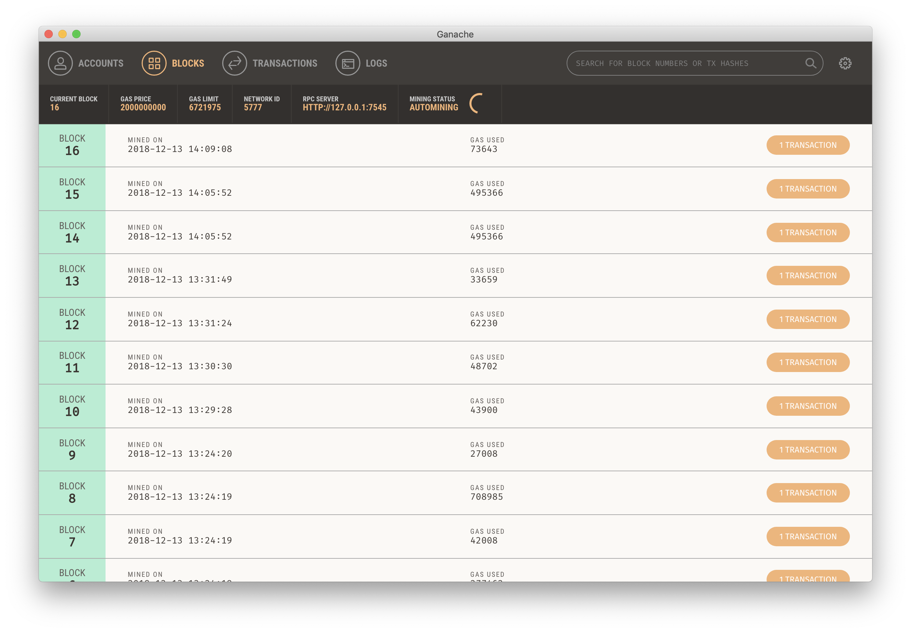

# Ganache

[Reference]

[ganache](https://truffleframework.com/ganache)

[ganache-quickstart](https://truffleframework.com/docs/ganache/quickstart)

Ganache는 이더리움 개발용 개인 블록체인(TestRPC)이다.
이더리움 컨트렉트 및 dApp 개발을 지원하며 테스트로 실행해볼 수 있다.

Ganache는 GUI와 CLI 동시에 지원한다.
 
## Ganache Desktop Applicaion

[Ganache install](https://github.com/trufflesuite/ganache/releases)에서 OS에 맞게 설치하거나

[Ganache repo](https://github.com/trufflesuite/ganache)에서 build에서 이용할 수 있다.


외부 소유 계정들(EOA)과 각각의 private key를 확인할 수 있다.


deployed된 트랜젝션을 확인할 수 있다.


블록 정보를 확인할 수 있다.



위의 내용을 포함한 블록체인 로그 확인할 수 있다.


## Ganache-Cli

cli 실행 화면이다.
외부 소유 계정들(EOA)과 각각의 private key를 확인할 수 있다.

```
$ npm install -g ganache-cli
```


```
$ ganache-cli
Ganache CLI v6.2.3 (ganache-core: 2.3.1)

Available Accounts
==================
(0) 0x24579de84e2a1f62db786af0825fa74cd09dbf75 (~100 ETH)
(1) 0x243027d328637f14f69f5a093c6216ae5f7fa6a5 (~100 ETH)
(2) 0xdb6883bc1812739f9c2431930a5053e0535e1da7 (~100 ETH)
(3) 0xc7c84022171679e87f3d55aa996f565f1b190852 (~100 ETH)
(4) 0xc0c197a2656896281999dad542ebca90d33eda36 (~100 ETH)
(5) 0xe9f20f43b1c16caac1fff4d05b0f6aa00a00810a (~100 ETH)
(6) 0x16a7bbcb3b369ec2e84ceb98f73c2bcbd84b9640 (~100 ETH)
(7) 0xf1fd02ce42e8f8a044612bc0389fd587f8ca5016 (~100 ETH)
(8) 0x4c859c59707a20682e4af1da8173e5537e08a8dd (~100 ETH)
(9) 0x2479c8528f6864afbcb1ed0ea6f55ec9a4f9eb46 (~100 ETH)

Private Keys
==================
(0) 0xcc37aceaad02a788f484528e3c3d7d024759f812308fd75710d183b8a57a3480
(1) 0x940a7b3e25fe6fb7ec44a29993965aa8db0cb40bc5918a471930aab28cb7eb5d
(2) 0xb379180bd7eab55bdb788fd17f4a0dd12610f1ee2967adf1a8e1eb4ce27725c4
(3) 0xb33b2ebdff43417859d553de133989da56a5e61a13eaa6269b9fea775de30d2a
(4) 0x2c18a963cb5c0715b285d7f9ae490d529c88372fb345d83f2b210e8b10a8955b
(5) 0x983649dcc9cf7bde3631057e03545e179fd8e18c0e9b81196716959836179181
(6) 0x03087f8006896e1effee7a7f5cef16e346b3c981fdb1665c6ab3c0967cac1998
(7) 0x1607b7b7814e05bdd38c844e8914b8f5a82519b7adf4ca88e290d1beae615015
(8) 0xe9f23b767626f78df443259e3f3cf96416c0dfe8d7930c71f902131f6a800039
(9) 0x27b9410aafcbce70ca0239557e8fd517da9fca9bf632bde8f2502a34cdfed2e4

HD Wallet
==================
Mnemonic:      virus submit profit negative solution twenty table where fault eyebrow frog fine
Base HD Path:  m/44'/60'/0'/0/{account_index}

Gas Price
==================
20000000000

Gas Limit
==================
6721975
```