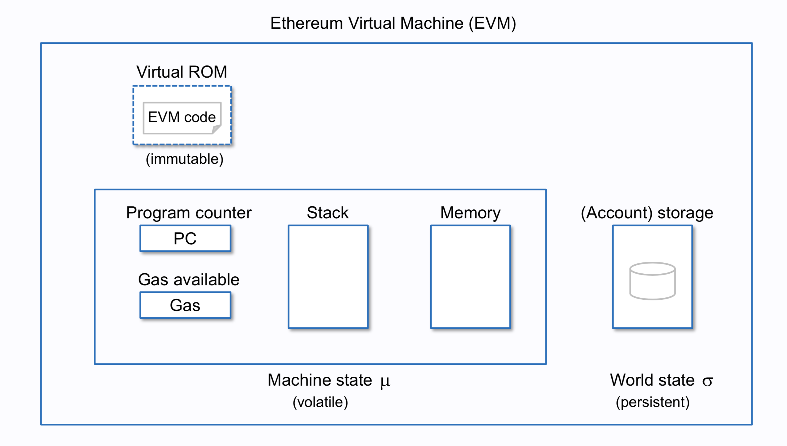
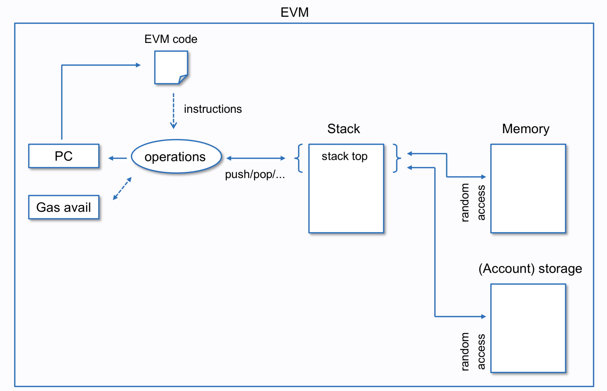
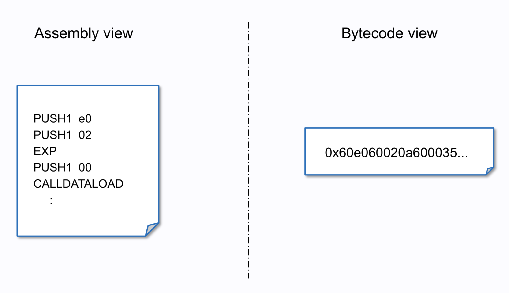
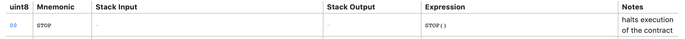

# EVM

[Reference]

[ethervm.io](https://ethervm.io)

[리틀엔디안little-endian과-빅엔디안big-endian이해하기](http://www.packetinside.com/2010/10/리틀엔디안little-endian과-빅엔디안big-endian이해하기.html)

[source-mappings](
https://solidity.readthedocs.io/en/develop/miscellaneous.html#source-mappings)

[Basic Questions About the Ethereum EVM and State Storage](https://www.reddit.com/r/ethereum/comments/3k4h3w/basic_questions_about_the_ethereum_evm_and_state/)

[ethereum_evm_illustrated](
https://takenobu-hs.github.io/downloads/ethereum_evm_illustrated.pdf)

[solidity-bytecode-and-opcode-basics](https://medium.com/@blockchain101/solidity-bytecode-and-opcode-basics-672e9b1a88c2)

[Solidity Assembly](https://solidity.readthedocs.io/en/develop/assembly.html)

EVM은 256 비트의 stack로 빅에디안 방식의 VM이다. 이더리움 블록체인에서 스마트 컨트렉트를 실행하는 가상 환경이다.

EVM 구조이다.

사실, EVM은 정확하게는 가상머신이 아니다. EVM 어셈블리 언어를 처리하기 위한 인터프리터이다. stack, memory byte-array, 컨트렉트 계정의 storage으로 구성되어 있다.



EVM의 실행 프로세스는 다음과 같다.

 EVM bytecode가 실행되는 동안, EVM 메모리는 일시적으로 얻는다. 수행 후, 할당이 해제된다. 주로 CPU에서 L1 or L2 cache를 사용한다.



## contract compile 과정

컨트렉트가 컴파일 과정을 분석하기 전에 어셈블리 관점과 bytecode 관점에서 보자.

어셈블리는 사람이 읽을 수 있는 low level언어이다. 이는 EVM에서는 Opcode라고 불린다. bytecode는 opcode로부터 생성된다.



solc로 컨트렉트가 컴파일 되는 과정은 다음과 같다.

1. solc로 contract code 컴파일
2. contract code는 opcode로 변환
3. opcode는 bytecode로 변환

간단한 테스트를 위해 [remix-ide](https://remix.ethereum.org)에서 다음 컨트렉트(contract.sol)를 컴파일 해보자.

constract.sol
```sol
pragma solidity >=0.4.22 <0.6.0;
contract Ballot {

    struct Voter {
        uint weight;
        bool voted;
        uint8 vote;
        address delegate;
    }
    struct Proposal {
        uint voteCount;
    }

    address chairperson;
    mapping(address => Voter) voters;
    Proposal[] proposals;

    /// Create a new ballot with $(_numProposals) different proposals.
    constructor(uint8 _numProposals) public {
        chairperson = msg.sender;
        voters[chairperson].weight = 1;
        proposals.length = _numProposals;
    }

    /// Give $(toVoter) the right to vote on this ballot.
    /// May only be called by $(chairperson).
    function giveRightToVote(address toVoter) public {
        if (msg.sender != chairperson || voters[toVoter].voted) return;
        voters[toVoter].weight = 1;
    }

    /// Delegate your vote to the voter $(to).
    function delegate(address to) public {
        Voter storage sender = voters[msg.sender]; // assigns reference
        if (sender.voted) return;
        while (voters[to].delegate != address(0) && voters[to].delegate != msg.sender)
            to = voters[to].delegate;
        if (to == msg.sender) return;
        sender.voted = true;
        sender.delegate = to;
        Voter storage delegateTo = voters[to];
        if (delegateTo.voted)
            proposals[delegateTo.vote].voteCount += sender.weight;
        else
            delegateTo.weight += sender.weight;
    }

    /// Give a single vote to proposal $(toProposal).
    function vote(uint8 toProposal) public {
        Voter storage sender = voters[msg.sender];
        if (sender.voted || toProposal >= proposals.length) return;
        sender.voted = true;
        sender.vote = toProposal;
        proposals[toProposal].voteCount += sender.weight;
    }

    function winningProposal() public view returns (uint8 _winningProposal) {
        uint256 winningVoteCount = 0;
        for (uint8 prop = 0; prop < proposals.length; prop++)
            if (proposals[prop].voteCount > winningVoteCount) {
                winningVoteCount = proposals[prop].voteCount;
                _winningProposal = prop;
            }
    }
}

```


contract.sol 예제를 compile 후 bytecode를 확인해보자.
다음의 json 데이터를 확인할 수 있다.


```
{
	"linkReferences": {},
	"object": "608060405234801561001057600080fd5b506040516020806108b88339810180604052602081101561003057600080fd5b8101908080519060200190929190505050336000806101000a81548173ffffffffffffffffffffffffffffffffffffffff021916908373ffffffffffffffffffffffffffffffffffffffff16021790555060018060008060009054906101000a900473ffffffffffffffffffffffffffffffffffffffff1673ffffffffffffffffffffffffffffffffffffffff1673ffffffffffffffffffffffffffffffffffffffff168152602001908152602001600020600001819055508060ff166002816100fa9190610101565b5050610154565b81548183558181111561012857818360005260206000209182019101610127919061012d565b5b505050565b61015191905b8082111561014d5760008082016000905550600101610133565b5090565b90565b610755806101636000396000f3fe608060405260043610610062576000357c0100000000000000000000000000000000000000000000000000000000900463ffffffff1680635c19a95c14610067578063609ff1bd146100b85780639e7b8d61146100e9578063b3f98adc1461013a575b600080fd5b34801561007357600080fd5b506100b66004803603602081101561008a57600080fd5b81019080803573ffffffffffffffffffffffffffffffffffffffff169060200190929190505050610178565b005b3480156100c457600080fd5b506100cd6104cd565b604051808260ff1660ff16815260200191505060405180910390f35b3480156100f557600080fd5b506101386004803603602081101561010c57600080fd5b81019080803573ffffffffffffffffffffffffffffffffffffffff169060200190929190505050610549565b005b34801561014657600080fd5b506101766004803603602081101561015d57600080fd5b81019080803560ff169060200190929190505050610646565b005b6000600160003373ffffffffffffffffffffffffffffffffffffffff1673ffffffffffffffffffffffffffffffffffffffff16815260200190815260200160002090508060010160009054906101000a900460ff16156101d857506104ca565b5b600073ffffffffffffffffffffffffffffffffffffffff16600160008473ffffffffffffffffffffffffffffffffffffffff1673ffffffffffffffffffffffffffffffffffffffff16815260200190815260200160002060010160029054906101000a900473ffffffffffffffffffffffffffffffffffffffff1673ffffffffffffffffffffffffffffffffffffffff161415801561030657503373ffffffffffffffffffffffffffffffffffffffff16600160008473ffffffffffffffffffffffffffffffffffffffff1673ffffffffffffffffffffffffffffffffffffffff16815260200190815260200160002060010160029054906101000a900473ffffffffffffffffffffffffffffffffffffffff1673ffffffffffffffffffffffffffffffffffffffff1614155b1561037557600160008373ffffffffffffffffffffffffffffffffffffffff1673ffffffffffffffffffffffffffffffffffffffff16815260200190815260200160002060010160029054906101000a900473ffffffffffffffffffffffffffffffffffffffff1691506101d9565b3373ffffffffffffffffffffffffffffffffffffffff168273ffffffffffffffffffffffffffffffffffffffff1614156103af57506104ca565b60018160010160006101000a81548160ff021916908315150217905550818160010160026101000a81548173ffffffffffffffffffffffffffffffffffffffff021916908373ffffffffffffffffffffffffffffffffffffffff1602179055506000600160008473ffffffffffffffffffffffffffffffffffffffff1673ffffffffffffffffffffffffffffffffffffffff16815260200190815260200160002090508060010160009054906101000a900460ff16156104b057816000015460028260010160019054906101000a900460ff1660ff1681548110151561049157fe5b90600052602060002001600001600082825401925050819055506104c7565b816000015481600001600082825401925050819055505b50505b50565b6000806000905060008090505b6002805490508160ff161015610544578160028260ff168154811015156104fd57fe5b906000526020600020016000015411156105375760028160ff1681548110151561052357fe5b906000526020600020016000015491508092505b80806001019150506104da565b505090565b6000809054906101000a900473ffffffffffffffffffffffffffffffffffffffff1673ffffffffffffffffffffffffffffffffffffffff163373ffffffffffffffffffffffffffffffffffffffff161415806105f15750600160008273ffffffffffffffffffffffffffffffffffffffff1673ffffffffffffffffffffffffffffffffffffffff16815260200190815260200160002060010160009054906101000a900460ff165b156105fb57610643565b60018060008373ffffffffffffffffffffffffffffffffffffffff1673ffffffffffffffffffffffffffffffffffffffff168152602001908152602001600020600001819055505b50565b6000600160003373ffffffffffffffffffffffffffffffffffffffff1673ffffffffffffffffffffffffffffffffffffffff16815260200190815260200160002090508060010160009054906101000a900460ff16806106ae57506002805490508260ff1610155b156106b95750610726565b60018160010160006101000a81548160ff021916908315150217905550818160010160016101000a81548160ff021916908360ff160217905550806000015460028360ff1681548110151561070a57fe5b9060005260206000200160000160008282540192505081905550505b5056fea165627a7a723058209cd949349bb197f81c62e9d966e6ce248c395b692c8b50baa4c1a23e6cce3cb60029",
	"opcodes": "PUSH1 0x80 PUSH1 0x40 MSTORE CALLVALUE DUP1 ISZERO PUSH2 0x10 JUMPI PUSH1 0x0 DUP1 REVERT JUMPDEST POP PUSH1 0x40 MLOAD PUSH1 0x20 DUP1 PUSH2 0x8B8 DUP4 CODECOPY DUP2 ADD DUP1 PUSH1 0x40 MSTORE PUSH1 0x20 DUP2 LT ISZERO PUSH2 0x30 JUMPI PUSH1 0x0 DUP1 REVERT JUMPDEST DUP2 ADD SWAP1 DUP1 DUP1 MLOAD SWAP1 PUSH1 0x20 ADD SWAP1 SWAP3 SWAP2 SWAP1 POP POP POP CALLER PUSH1 0x0 DUP1 PUSH2 0x100 EXP DUP2 SLOAD DUP2 PUSH20 0xFFFFFFFFFFFFFFFFFFFFFFFFFFFFFFFFFFFFFFFF MUL NOT AND SWAP1 DUP4 PUSH20 0xFFFFFFFFFFFFFFFFFFFFFFFFFFFFFFFFFFFFFFFF AND MUL OR SWAP1 SSTORE POP PUSH1 0x1 DUP1 PUSH1 0x0 DUP1 PUSH1 0x0 SWAP1 SLOAD SWAP1 PUSH2 0x100 EXP SWAP1 DIV PUSH20 0xFFFFFFFFFFFFFFFFFFFFFFFFFFFFFFFFFFFFFFFF AND PUSH20 0xFFFFFFFFFFFFFFFFFFFFFFFFFFFFFFFFFFFFFFFF AND PUSH20 0xFFFFFFFFFFFFFFFFFFFFFFFFFFFFFFFFFFFFFFFF AND DUP2 MSTORE PUSH1 0x20 ADD SWAP1 DUP2 MSTORE PUSH1 0x20 ADD PUSH1 0x0 KECCAK256 PUSH1 0x0 ADD DUP2 SWAP1 SSTORE POP DUP1 PUSH1 0xFF AND PUSH1 0x2 DUP2 PUSH2 0xFA SWAP2 SWAP1 PUSH2 0x101 JUMP JUMPDEST POP POP PUSH2 0x154 JUMP JUMPDEST DUP2 SLOAD DUP2 DUP4 SSTORE DUP2 DUP2 GT ISZERO PUSH2 0x128 JUMPI DUP2 DUP4 PUSH1 0x0 MSTORE PUSH1 0x20 PUSH1 0x0 KECCAK256 SWAP2 DUP3 ADD SWAP2 ADD PUSH2 0x127 SWAP2 SWAP1 PUSH2 0x12D JUMP JUMPDEST JUMPDEST POP POP POP JUMP JUMPDEST PUSH2 0x151 SWAP2 SWAP1 JUMPDEST DUP1 DUP3 GT ISZERO PUSH2 0x14D JUMPI PUSH1 0x0 DUP1 DUP3 ADD PUSH1 0x0 SWAP1 SSTORE POP PUSH1 0x1 ADD PUSH2 0x133 JUMP JUMPDEST POP SWAP1 JUMP JUMPDEST SWAP1 JUMP JUMPDEST PUSH2 0x755 DUP1 PUSH2 0x163 PUSH1 0x0 CODECOPY PUSH1 0x0 RETURN INVALID PUSH1 0x80 PUSH1 0x40 MSTORE PUSH1 0x4 CALLDATASIZE LT PUSH2 0x62 JUMPI PUSH1 0x0 CALLDATALOAD PUSH29 0x100000000000000000000000000000000000000000000000000000000 SWAP1 DIV PUSH4 0xFFFFFFFF AND DUP1 PUSH4 0x5C19A95C EQ PUSH2 0x67 JUMPI DUP1 PUSH4 0x609FF1BD EQ PUSH2 0xB8 JUMPI DUP1 PUSH4 0x9E7B8D61 EQ PUSH2 0xE9 JUMPI DUP1 PUSH4 0xB3F98ADC EQ PUSH2 0x13A JUMPI JUMPDEST PUSH1 0x0 DUP1 REVERT JUMPDEST CALLVALUE DUP1 ISZERO PUSH2 0x73 JUMPI PUSH1 0x0 DUP1 REVERT JUMPDEST POP PUSH2 0xB6 PUSH1 0x4 DUP1 CALLDATASIZE SUB PUSH1 0x20 DUP2 LT ISZERO PUSH2 0x8A JUMPI PUSH1 0x0 DUP1 REVERT JUMPDEST DUP2 ADD SWAP1 DUP1 DUP1 CALLDATALOAD PUSH20 0xFFFFFFFFFFFFFFFFFFFFFFFFFFFFFFFFFFFFFFFF AND SWAP1 PUSH1 0x20 ADD SWAP1 SWAP3 SWAP2 SWAP1 POP POP POP PUSH2 0x178 JUMP JUMPDEST STOP JUMPDEST CALLVALUE DUP1 ISZERO PUSH2 0xC4 JUMPI PUSH1 0x0 DUP1 REVERT JUMPDEST POP PUSH2 0xCD PUSH2 0x4CD JUMP JUMPDEST PUSH1 0x40 MLOAD DUP1 DUP3 PUSH1 0xFF AND PUSH1 0xFF AND DUP2 MSTORE PUSH1 0x20 ADD SWAP2 POP POP PUSH1 0x40 MLOAD DUP1 SWAP2 SUB SWAP1 RETURN JUMPDEST CALLVALUE DUP1 ISZERO PUSH2 0xF5 JUMPI PUSH1 0x0 DUP1 REVERT JUMPDEST POP PUSH2 0x138 PUSH1 0x4 DUP1 CALLDATASIZE SUB PUSH1 0x20 DUP2 LT ISZERO PUSH2 0x10C JUMPI PUSH1 0x0 DUP1 REVERT JUMPDEST DUP2 ADD SWAP1 DUP1 DUP1 CALLDATALOAD PUSH20 0xFFFFFFFFFFFFFFFFFFFFFFFFFFFFFFFFFFFFFFFF AND SWAP1 PUSH1 0x20 ADD SWAP1 SWAP3 SWAP2 SWAP1 POP POP POP PUSH2 0x549 JUMP JUMPDEST STOP JUMPDEST CALLVALUE DUP1 ISZERO PUSH2 0x146 JUMPI PUSH1 0x0 DUP1 REVERT JUMPDEST POP PUSH2 0x176 PUSH1 0x4 DUP1 CALLDATASIZE SUB PUSH1 0x20 DUP2 LT ISZERO PUSH2 0x15D JUMPI PUSH1 0x0 DUP1 REVERT JUMPDEST DUP2 ADD SWAP1 DUP1 DUP1 CALLDATALOAD PUSH1 0xFF AND SWAP1 PUSH1 0x20 ADD SWAP1 SWAP3 SWAP2 SWAP1 POP POP POP PUSH2 0x646 JUMP JUMPDEST STOP JUMPDEST PUSH1 0x0 PUSH1 0x1 PUSH1 0x0 CALLER PUSH20 0xFFFFFFFFFFFFFFFFFFFFFFFFFFFFFFFFFFFFFFFF AND PUSH20 0xFFFFFFFFFFFFFFFFFFFFFFFFFFFFFFFFFFFFFFFF AND DUP2 MSTORE PUSH1 0x20 ADD SWAP1 DUP2 MSTORE PUSH1 0x20 ADD PUSH1 0x0 KECCAK256 SWAP1 POP DUP1 PUSH1 0x1 ADD PUSH1 0x0 SWAP1 SLOAD SWAP1 PUSH2 0x100 EXP SWAP1 DIV PUSH1 0xFF AND ISZERO PUSH2 0x1D8 JUMPI POP PUSH2 0x4CA JUMP JUMPDEST JUMPDEST PUSH1 0x0 PUSH20 0xFFFFFFFFFFFFFFFFFFFFFFFFFFFFFFFFFFFFFFFF AND PUSH1 0x1 PUSH1 0x0 DUP5 PUSH20 0xFFFFFFFFFFFFFFFFFFFFFFFFFFFFFFFFFFFFFFFF AND PUSH20 0xFFFFFFFFFFFFFFFFFFFFFFFFFFFFFFFFFFFFFFFF AND DUP2 MSTORE PUSH1 0x20 ADD SWAP1 DUP2 MSTORE PUSH1 0x20 ADD PUSH1 0x0 KECCAK256 PUSH1 0x1 ADD PUSH1 0x2 SWAP1 SLOAD SWAP1 PUSH2 0x100 EXP SWAP1 DIV PUSH20 0xFFFFFFFFFFFFFFFFFFFFFFFFFFFFFFFFFFFFFFFF AND PUSH20 0xFFFFFFFFFFFFFFFFFFFFFFFFFFFFFFFFFFFFFFFF AND EQ ISZERO DUP1 ISZERO PUSH2 0x306 JUMPI POP CALLER PUSH20 0xFFFFFFFFFFFFFFFFFFFFFFFFFFFFFFFFFFFFFFFF AND PUSH1 0x1 PUSH1 0x0 DUP5 PUSH20 0xFFFFFFFFFFFFFFFFFFFFFFFFFFFFFFFFFFFFFFFF AND PUSH20 0xFFFFFFFFFFFFFFFFFFFFFFFFFFFFFFFFFFFFFFFF AND DUP2 MSTORE PUSH1 0x20 ADD SWAP1 DUP2 MSTORE PUSH1 0x20 ADD PUSH1 0x0 KECCAK256 PUSH1 0x1 ADD PUSH1 0x2 SWAP1 SLOAD SWAP1 PUSH2 0x100 EXP SWAP1 DIV PUSH20 0xFFFFFFFFFFFFFFFFFFFFFFFFFFFFFFFFFFFFFFFF AND PUSH20 0xFFFFFFFFFFFFFFFFFFFFFFFFFFFFFFFFFFFFFFFF AND EQ ISZERO JUMPDEST ISZERO PUSH2 0x375 JUMPI PUSH1 0x1 PUSH1 0x0 DUP4 PUSH20 0xFFFFFFFFFFFFFFFFFFFFFFFFFFFFFFFFFFFFFFFF AND PUSH20 0xFFFFFFFFFFFFFFFFFFFFFFFFFFFFFFFFFFFFFFFF AND DUP2 MSTORE PUSH1 0x20 ADD SWAP1 DUP2 MSTORE PUSH1 0x20 ADD PUSH1 0x0 KECCAK256 PUSH1 0x1 ADD PUSH1 0x2 SWAP1 SLOAD SWAP1 PUSH2 0x100 EXP SWAP1 DIV PUSH20 0xFFFFFFFFFFFFFFFFFFFFFFFFFFFFFFFFFFFFFFFF AND SWAP2 POP PUSH2 0x1D9 JUMP JUMPDEST CALLER PUSH20 0xFFFFFFFFFFFFFFFFFFFFFFFFFFFFFFFFFFFFFFFF AND DUP3 PUSH20 0xFFFFFFFFFFFFFFFFFFFFFFFFFFFFFFFFFFFFFFFF AND EQ ISZERO PUSH2 0x3AF JUMPI POP PUSH2 0x4CA JUMP JUMPDEST PUSH1 0x1 DUP2 PUSH1 0x1 ADD PUSH1 0x0 PUSH2 0x100 EXP DUP2 SLOAD DUP2 PUSH1 0xFF MUL NOT AND SWAP1 DUP4 ISZERO ISZERO MUL OR SWAP1 SSTORE POP DUP2 DUP2 PUSH1 0x1 ADD PUSH1 0x2 PUSH2 0x100 EXP DUP2 SLOAD DUP2 PUSH20 0xFFFFFFFFFFFFFFFFFFFFFFFFFFFFFFFFFFFFFFFF MUL NOT AND SWAP1 DUP4 PUSH20 0xFFFFFFFFFFFFFFFFFFFFFFFFFFFFFFFFFFFFFFFF AND MUL OR SWAP1 SSTORE POP PUSH1 0x0 PUSH1 0x1 PUSH1 0x0 DUP5 PUSH20 0xFFFFFFFFFFFFFFFFFFFFFFFFFFFFFFFFFFFFFFFF AND PUSH20 0xFFFFFFFFFFFFFFFFFFFFFFFFFFFFFFFFFFFFFFFF AND DUP2 MSTORE PUSH1 0x20 ADD SWAP1 DUP2 MSTORE PUSH1 0x20 ADD PUSH1 0x0 KECCAK256 SWAP1 POP DUP1 PUSH1 0x1 ADD PUSH1 0x0 SWAP1 SLOAD SWAP1 PUSH2 0x100 EXP SWAP1 DIV PUSH1 0xFF AND ISZERO PUSH2 0x4B0 JUMPI DUP2 PUSH1 0x0 ADD SLOAD PUSH1 0x2 DUP3 PUSH1 0x1 ADD PUSH1 0x1 SWAP1 SLOAD SWAP1 PUSH2 0x100 EXP SWAP1 DIV PUSH1 0xFF AND PUSH1 0xFF AND DUP2 SLOAD DUP2 LT ISZERO ISZERO PUSH2 0x491 JUMPI INVALID JUMPDEST SWAP1 PUSH1 0x0 MSTORE PUSH1 0x20 PUSH1 0x0 KECCAK256 ADD PUSH1 0x0 ADD PUSH1 0x0 DUP3 DUP3 SLOAD ADD SWAP3 POP POP DUP2 SWAP1 SSTORE POP PUSH2 0x4C7 JUMP JUMPDEST DUP2 PUSH1 0x0 ADD SLOAD DUP2 PUSH1 0x0 ADD PUSH1 0x0 DUP3 DUP3 SLOAD ADD SWAP3 POP POP DUP2 SWAP1 SSTORE POP JUMPDEST POP POP JUMPDEST POP JUMP JUMPDEST PUSH1 0x0 DUP1 PUSH1 0x0 SWAP1 POP PUSH1 0x0 DUP1 SWAP1 POP JUMPDEST PUSH1 0x2 DUP1 SLOAD SWAP1 POP DUP2 PUSH1 0xFF AND LT ISZERO PUSH2 0x544 JUMPI DUP2 PUSH1 0x2 DUP3 PUSH1 0xFF AND DUP2 SLOAD DUP2 LT ISZERO ISZERO PUSH2 0x4FD JUMPI INVALID JUMPDEST SWAP1 PUSH1 0x0 MSTORE PUSH1 0x20 PUSH1 0x0 KECCAK256 ADD PUSH1 0x0 ADD SLOAD GT ISZERO PUSH2 0x537 JUMPI PUSH1 0x2 DUP2 PUSH1 0xFF AND DUP2 SLOAD DUP2 LT ISZERO ISZERO PUSH2 0x523 JUMPI INVALID JUMPDEST SWAP1 PUSH1 0x0 MSTORE PUSH1 0x20 PUSH1 0x0 KECCAK256 ADD PUSH1 0x0 ADD SLOAD SWAP2 POP DUP1 SWAP3 POP JUMPDEST DUP1 DUP1 PUSH1 0x1 ADD SWAP2 POP POP PUSH2 0x4DA JUMP JUMPDEST POP POP SWAP1 JUMP JUMPDEST PUSH1 0x0 DUP1 SWAP1 SLOAD SWAP1 PUSH2 0x100 EXP SWAP1 DIV PUSH20 0xFFFFFFFFFFFFFFFFFFFFFFFFFFFFFFFFFFFFFFFF AND PUSH20 0xFFFFFFFFFFFFFFFFFFFFFFFFFFFFFFFFFFFFFFFF AND CALLER PUSH20 0xFFFFFFFFFFFFFFFFFFFFFFFFFFFFFFFFFFFFFFFF AND EQ ISZERO DUP1 PUSH2 0x5F1 JUMPI POP PUSH1 0x1 PUSH1 0x0 DUP3 PUSH20 0xFFFFFFFFFFFFFFFFFFFFFFFFFFFFFFFFFFFFFFFF AND PUSH20 0xFFFFFFFFFFFFFFFFFFFFFFFFFFFFFFFFFFFFFFFF AND DUP2 MSTORE PUSH1 0x20 ADD SWAP1 DUP2 MSTORE PUSH1 0x20 ADD PUSH1 0x0 KECCAK256 PUSH1 0x1 ADD PUSH1 0x0 SWAP1 SLOAD SWAP1 PUSH2 0x100 EXP SWAP1 DIV PUSH1 0xFF AND JUMPDEST ISZERO PUSH2 0x5FB JUMPI PUSH2 0x643 JUMP JUMPDEST PUSH1 0x1 DUP1 PUSH1 0x0 DUP4 PUSH20 0xFFFFFFFFFFFFFFFFFFFFFFFFFFFFFFFFFFFFFFFF AND PUSH20 0xFFFFFFFFFFFFFFFFFFFFFFFFFFFFFFFFFFFFFFFF AND DUP2 MSTORE PUSH1 0x20 ADD SWAP1 DUP2 MSTORE PUSH1 0x20 ADD PUSH1 0x0 KECCAK256 PUSH1 0x0 ADD DUP2 SWAP1 SSTORE POP JUMPDEST POP JUMP JUMPDEST PUSH1 0x0 PUSH1 0x1 PUSH1 0x0 CALLER PUSH20 0xFFFFFFFFFFFFFFFFFFFFFFFFFFFFFFFFFFFFFFFF AND PUSH20 0xFFFFFFFFFFFFFFFFFFFFFFFFFFFFFFFFFFFFFFFF AND DUP2 MSTORE PUSH1 0x20 ADD SWAP1 DUP2 MSTORE PUSH1 0x20 ADD PUSH1 0x0 KECCAK256 SWAP1 POP DUP1 PUSH1 0x1 ADD PUSH1 0x0 SWAP1 SLOAD SWAP1 PUSH2 0x100 EXP SWAP1 DIV PUSH1 0xFF AND DUP1 PUSH2 0x6AE JUMPI POP PUSH1 0x2 DUP1 SLOAD SWAP1 POP DUP3 PUSH1 0xFF AND LT ISZERO JUMPDEST ISZERO PUSH2 0x6B9 JUMPI POP PUSH2 0x726 JUMP JUMPDEST PUSH1 0x1 DUP2 PUSH1 0x1 ADD PUSH1 0x0 PUSH2 0x100 EXP DUP2 SLOAD DUP2 PUSH1 0xFF MUL NOT AND SWAP1 DUP4 ISZERO ISZERO MUL OR SWAP1 SSTORE POP DUP2 DUP2 PUSH1 0x1 ADD PUSH1 0x1 PUSH2 0x100 EXP DUP2 SLOAD DUP2 PUSH1 0xFF MUL NOT AND SWAP1 DUP4 PUSH1 0xFF AND MUL OR SWAP1 SSTORE POP DUP1 PUSH1 0x0 ADD SLOAD PUSH1 0x2 DUP4 PUSH1 0xFF AND DUP2 SLOAD DUP2 LT ISZERO ISZERO PUSH2 0x70A JUMPI INVALID JUMPDEST SWAP1 PUSH1 0x0 MSTORE PUSH1 0x20 PUSH1 0x0 KECCAK256 ADD PUSH1 0x0 ADD PUSH1 0x0 DUP3 DUP3 SLOAD ADD SWAP3 POP POP DUP2 SWAP1 SSTORE POP POP JUMPDEST POP JUMP INVALID LOG1 PUSH6 0x627A7A723058 KECCAK256 SWAP13 0xd9 0x49 CALLVALUE SWAP12 0xb1 SWAP8 0xf8 SHR PUSH3 0xE9D966 0xe6 0xce 0x24 DUP13 CODECOPY JUMPDEST PUSH10 0x2C8B50BAA4C1A23E6CCE EXTCODECOPY 0xb6 STOP 0x29 ",
	"sourceMap": "33:2130:0:-;;;382:163;8:9:-1;5:2;;;30:1;27;20:12;5:2;382:163:0;;;;;;;;;;;;;13:2:-1;8:3;5:11;2:2;;;29:1;26;19:12;2:2;382:163:0;;;;;;;;;;;;;;;;446:10;432:11;;:24;;;;;;;;;;;;;;;;;;495:1;466:6;:19;473:11;;;;;;;;;;;466:19;;;;;;;;;;;;;;;:26;;:30;;;;525:13;506:32;;:9;:32;;;;;:::i;:::-;;382:163;33:2130;;;;;;;;;;;;;;;;;;;;;;;;;;;;;;:::i;:::-;;;;;:::o;:::-;;;;;;;;;;;;;;;;;;;;;;;;;;;;;:::o;:::-;;;;;;;"
}
```

예를 들어
```PUSH1 0x80```는 evm opcode에 PUSH1는 60의 값과 매핑이 된다.


그렇기 때문에 bytecode는 PUSH1(60)과 0x80(80)이 합쳐져 6080이 된다.

```STOP 0x29```은 evm opcode에 STOP은 00의 값과 매핑이 된다.



위와 마찬가지로, bytecode는 STOP(00)과 0x29(29)이 합쳐져 0029가 된다.


