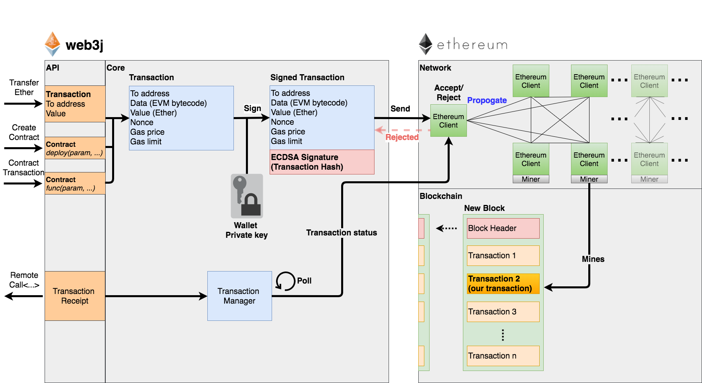

# Transactions

[Reference]

[ethereum_evm_illustrated](
https://takenobu-hs.github.io/downloads/ethereum_evm_illustrated.pdf)

트랜젝션에는 

Contract Creation과 Message Call로 크게 두가지 종류가 있다.

## Contract Creation

컨트렉트가 생성될 때는,

Transaction 내에 bytecode

컨트렉트계정이 생성되고 account state에 code와 storage와의 매핑이 된다.

## Message Call

address N의 컨트렉트 계정에 데이터를 CRUD하는 트랜젝션을 
t에서 t+1으로 했을 때,
storage가 해당 데이터가 갱신된다.

## Transaction Structure

[Reference]

[can_someone_please_explain_nonce_to_me](https://www.reddit.com/r/ethereum/comments/6ihw6p/can_someone_please_explain_nonce_to_me/)

[ethereum-signing-and-validating-13a2d7cb0ee3](https://medium.com/@angellopozo/ethereum-signing-and-validating-13a2d7cb0ee3)

[web3](https://web3j.readthedocs.io/en/latest/transactions.html)

[이더리움(Ethereum) 공부 #3 - 트랜잭션과 서명](https://steemit.com/busy/@anpigon/ethereum-3?sort=author_reputation)

transation에는 

nonce: 계정이 보낸 트랜젝션의 수 (mysql의 autoincrement라 생각해도 됨)

gasPrice: 트랜젝션을 실행하는데 필요한 가스(단위 Wei)

gasLimit: gas의 최대 값

nonce: EOA에 발급되는 트랜잭션 일련번호.

to: 트랜젝션 받는 이의 주소이다.
Message Call의 경우에 주소가 할당되어 있다.
하지만, Contract Creation의 경우에는 컨트렉트 계정 주소가 아직 생성 전이기 때문에 0 값이 할당된다.

value: 수신자에게 보내는 이더(ether) 개수

data: 가변길이의 바이너리 데이터(payload)

v, r, s: ECDSA 서명 구성 요소

web3와 ethereum 간에 트랜젝션 관계이다.

