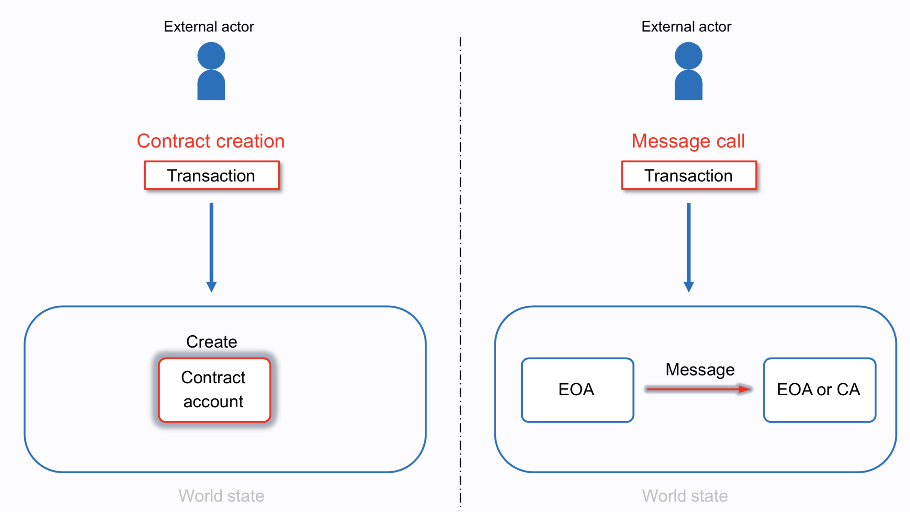
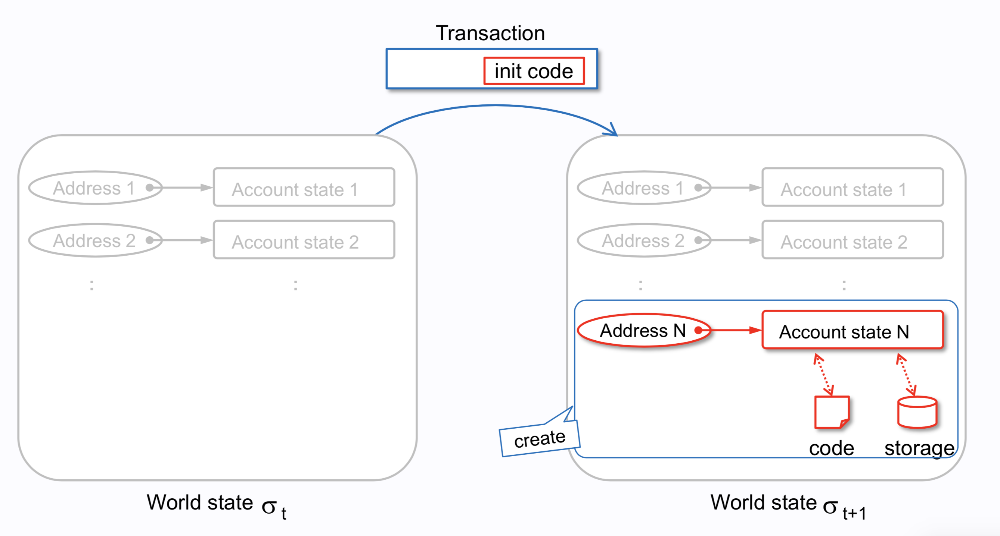
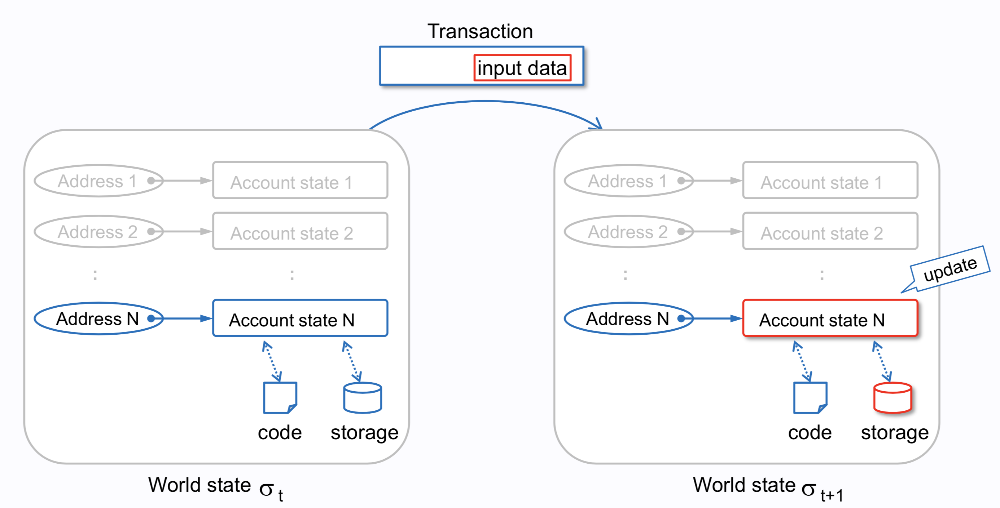
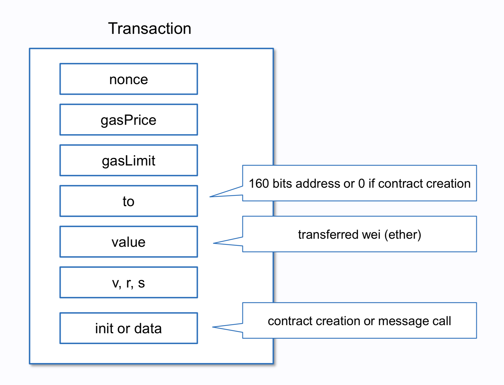

# Transactions

[Reference]

[ethereum_evm_illustrated](
https://takenobu-hs.github.io/downloads/ethereum_evm_illustrated.pdf)

트랜젝션에는 

Contract Creation과 Message Call로 크게 두가지 종류가 있다.

## Contract Creation

컨트렉트가 생성될 때는,

Transaction 내에 bytecode

컨트렉트계정이 생성되고 account state에 code와 storage와의 매핑이 된다.

## Message Call

address N의 컨트렉트 계정에 데이터를 CRUD하는 트랜젝션을 
t에서 t+1으로 했을 때,
storage가 해당 데이터가 갱신된다.

## Transaction Structure

[Reference]

[can_someone_please_explain_nonce_to_me](https://www.reddit.com/r/ethereum/comments/6ihw6p/can_someone_please_explain_nonce_to_me/)

[ethereum-signing-and-validating-13a2d7cb0ee3](https://medium.com/@angellopozo/ethereum-signing-and-validating-13a2d7cb0ee3)

transation에는 

nonce: 계정이 보낸 트랜젝션의 수 (mysql의 autoincrement라 생각해도 됨)

gasPrice: the number of Wei that the sender is willing to pay per unit of gas required to execute the transaction.

gasLimit: the maximum amount of gas that the sender is willing to pay for executing this transaction. This amount is set and paid upfront, before any computation is done.

to: 트랜젝션 받는 이의 주소이다.
Message Call의 경우에 주소가 할당되어 있다.
하지만, Contract Creation의 경우에는 컨트렉트 계정 주소가 아직 생성 전이기 때문에 0 값이 할당된다.

value: the amount of Wei to be transferred from the sender to the recipient. In a contract-creating transaction, this value serves as the starting balance within the newly created contract account.

v, r, s: used to generate the signature that identifies the sender of the transaction.

init (only exists for contract-creating transactions): An EVM code fragment that is used to initialize the new contract account. init is run only once, and then is discarded. When init is first run, it returns the body of the account code, which is the piece of code that is permanently associated with the contract account.

data (optional field that only exists for message calls): 
the input data (i.e. parameters) of the message call. For example, if a smart contract serves as a domain registration service, a call to that contract might expect input fields such as the domain and IP address.

